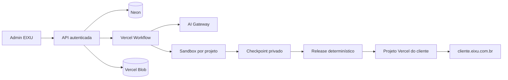

# EIXU

A EIXU reúne o site institucional e uma plataforma interna para criar e manter sites de clientes por conversa. O operador trabalha em uma única jornada em `/admin/[tenant]`: dados do cliente, chat, prévia desktop/mobile, CMS leve, acervo de imagens e publicação em `cliente.eixu.com.br`.

O Studio gera projetos Next.js independentes. Cada cliente tem código, conteúdo versionado, Sandbox, projeto Vercel e histórico de releases próprios. A plataforma central conserva autenticação, gestão, leads, eventos, WhatsApp e o Kanban.

A implementação desta branch ainda não foi publicada nem usada para limpar ambientes remotos. O estado e os limites da entrega estão em [Execução do chat livre](docs/execucao-chat-livre.md).

## Jornada do operador

1. Cadastre fatos, contatos, história, links, logo, cores e referências em `/admin/[tenant]/dados`.
2. Abra `/admin/[tenant]` e descreva livremente o site ou a alteração no chat.
3. O harness lê primeiro os dados do cliente e a fonte oficial, depois inspeciona a referência visual e registra direção de arte.
4. O agente trabalha no projeto isolado, valida código e conteúdo e cria um checkpoint.
5. A prévia autenticada abre no painel em desktop ou mobile.
6. Textos e imagens declarados em `content/schema.json` podem ser editados pelo CMS leve.
7. Publicar congela código e conteúdo, executa os gates e promove a mesma revisão no projeto Vercel do cliente.

A referência visual comanda composição, tipografia, ritmo, superfícies e movimento. A direção escolhida serve como fallback:

| Direção      | Referência principal                                         |
| ------------ | ------------------------------------------------------------ |
| Comercial    | [Minatel Brotas](https://minatelsupermercados.com.br/brotas) |
| Moderno      | [Reflect](https://reflect.app/)                              |
| Ousado       | [Manesco](https://manesco.com.br/)                           |
| Artístico    | [Actionline](https://actionline.io/)                         |
| Landing Page | [Nubank Ultravioleta](https://nubank.com.br/ultravioleta)    |

Essas referências orientam a leitura visual; não autorizam copiar marca, texto, imagens ou código.

## Harness

O chat usa AI SDK 7, `WorkflowAgent`, Vercel Workflow, AI Gateway e Vercel Sandbox. O catálogo de ferramentas é pequeno e tipado: leitura do contexto, inspeção de fontes, arquivos, comandos permitidos, artefatos, screenshots, imagens e checkpoints. Banco, Vercel e publicação ficam fora da autonomia do modelo e passam por serviços determinísticos.

A política de modelos é definida por tarefa:

- **GPT-5.6 Terra:** conversa, síntese do contexto e decisões editoriais;
- **GPT-5.6 Sol:** direção de arte, implementação, refinamento, crítica e diagnóstico de maior risco;
- **GPT-5.6 Luna:** tarefas curtas e mecânicas de apoio.

Os níveis de reasoning são aplicados no servidor. O operador não escolhe modelo ou effort. Consulte [Harness e modelos](docs/harness.md) e o [estudo do AI SDK](docs/estudo-ai-sdk-chat-livre.md).

## Arquitetura



- `app/(main)`: institucional da EIXU;
- `app/(admin)`: gestão, Studio, dados, imagens e Kanban;
- `app/api/chat` e `lib/studio`: conversa durável e harness;
- `db/schema.sql`: tenants, mensagens, runs, artefatos, conteúdo e releases;
- `app/api/form`, `app/api/e` e `app/go/wa`: integrações públicas centrais;
- `scripts/reset-sites.mjs`: manifesto e reset controlado dos dados antigos.

Veja [Arquitetura](docs/architecture.md) para os contratos completos.

## Desenvolvimento local

Requisitos: Node.js `>=22.17.0`, npm e recursos de desenvolvimento separados dos ambientes de produção.

```bash
npm ci
cp .env.example .env.local
npm run db:migrate
ADMIN_INITIAL_PIN='<pin-inicial>' npm run db:provision-admins
npm run dev:vercel
```

A tela de login fica em [localhost:3000/admin](http://localhost:3000/admin). Não copie credenciais ou dados pessoais de produção para o ambiente local.

Variáveis principais:

| Variável                                              | Uso                                                             |
| ----------------------------------------------------- | --------------------------------------------------------------- |
| `DATABASE_URL`                                        | Neon usado pela aplicação.                                      |
| `ADMIN_PIN_PEPPER` / `ADMIN_SESSION_SECRET`           | Login e sessão dos operadores.                                  |
| `AI_GATEWAY_API_KEY`                                  | Opcional fora da Vercel; deployments usam OIDC automaticamente. |
| `BLOB_READ_WRITE_TOKEN`                               | Assets, checkpoints e artefatos.                                |
| `EIXU_IMAGE_MODEL`                                    | Modelo de imagem; padrão `openai/gpt-image-2`.                  |
| `EIXU_VERCEL_TOKEN`                                   | API de projetos, deployments, domínios e promoção.              |
| `EIXU_VERCEL_BYPASS_MASTER_SECRET`                    | Deriva o bypass isolado de smoke para cada preview protegido.   |
| `VERCEL_ORG_ID` / `VERCEL_PROJECT_ID`                 | IDs nativos, expostos automaticamente pela Vercel.              |
| `EIXU_VERCEL_TEAM_ID` / `EIXU_VERCEL_ROOT_PROJECT_ID` | Overrides opcionais somente fora da Vercel.                     |
| `KANBAN_AGENT_TOKEN`                                  | Bearer restrito às rotas do Kanban.                             |

O arquivo [.env.example](.env.example) contém a lista completa sem valores secretos.

## Verificação

```bash
npx next typegen && npx tsc --noEmit
npm run lint
npm run test:studio
npm run test:admin
npm run build:vercel
```

`npm run test:sites` é o alias enxuto para os contratos do Studio. Chamadas de modelos, Sandbox remoto, deploy e reset não fazem parte desses checks locais. O procedimento completo está em [Verificação](docs/verification.md).

## Reset dos sites antigos

O reset preserva operadores, autenticação, Kanban e institucional. Ele remove tenants, projetos, imagens, conversas, leads, métricas, assets e projetos Vercel de clientes nos ambientes explicitamente selecionados.

O comando normal gera somente um manifesto. A execução exige o digest e o fingerprint desse manifesto, um deployment saudável do projeto raiz e uma referência de recuperação:

```bash
npm run db:reset-sites -- --environment=preview --manifest
```

O modo destrutivo também exige `--manifest-created-at` e só aceita um manifesto com até 30 minutos. Nunca execute sem revisar o inventário recém-gerado e confirmar o recurso exato. Produção e preview têm recibos separados.

## Documentação

O [índice](docs/README.md) separa contratos vigentes, estudo técnico e plano datado. [SOUL.md](SOUL.md) define a identidade e os critérios editoriais do Studio.
