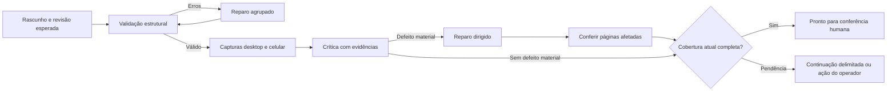

# Plano de otimização do admin e da criação de sites

**Status: núcleo implementado e validado localmente; ensaio pago pendente.**
Análise de 11/09/2026, com consulta ao banco em 12/09 às 01:06 UTC, equivalente
a 11/09 às 22:06 em Fortaleza. Código de referência do diagnóstico:
49b9efcaad027341414fa80a7bd652270a99abc7.

O objetivo é tornar a criação mais simples de operar, diminuir retrabalho na revisão e produzir quatro direções visuais reconhecíveis. A prioridade é o ciclo de revisão. A interface já tem uma base consistente; os maiores problemas estão na coordenação do trabalho, na informação disponível ao operador e na tradução das vibes para a composição.

A implementação cobre o núcleo das entregas 1–5 e partes de baixo risco da 6: eventos
correlacionados, revisão incremental, três etapas visíveis, cadastro compacto,
plano de cenas unificado, quatro contratos visuais v3, troca de vibe em
rascunho, snapshot completo, proteção de formulário, retorno após login e uso
exato de imagens. Histórico/edição de gastos, contatos paginados e consolidação
durável de custos continuam como trabalho P2 porque ampliam contratos próprios
de dados e não são necessários para corrigir criação e revisão. Comparação lado
a lado com o site publicado e descarte integral de uma recomposição continuam
como evolução própria sobre o snapshot; a versão pública permanece preservada.

## 1. Evidência e limites da análise

Foram percorridas as seis telas principais: entrada, clientes/cadastro, Site, Imagens, Dados e Tráfego; seus componentes, ações, APIs e consumidores de geração, revisão, publicação, contatos e tracking. A análise também considerou os manuais atuais, os testes existentes e as capturas comparativas das vibes.

A inspeção em navegador usou componentes e CSS atuais, respostas sintéticas e larguras de 1440 e 390 px. Não houve erros de JavaScript nem overflow horizontal do documento nessas telas. Isso não comprova ausência de problemas em toda interação ou cliente. A fixture de Tráfego contém o relatório, mas não o formulário de gastos e os filtros da página pai; esses fluxos foram examinados no código. Login real, upload, publicação, geração paga e envio de contatos não foram executados.

A primeira fixture utilizava CSS de um build antigo e foi descartada como evidência visual. As capturas finais substituem esse CSS somente no navegador pelo CSS atual compilado com o PostCSS/Tailwind instalado. Não houve alteração da aplicação.

As consultas ao projeto Neon eixu-sites, branch main, banco neondb, foram SELECTs agregados. Não foram exportados nomes, contatos, briefings, conversas ou conteúdo de clientes.

Evidências locais: [métricas e perfis agregados](../outputs/admin-plan-2026-09-11/metrics.json), [observações do navegador](../outputs/admin-plan-2026-09-11/browser-observations.json), [editor desktop](../outputs/admin-plan-2026-09-11/editor-1440.png), [cadastro desktop](../outputs/admin-plan-2026-09-11/cadastro-1440.png) e [Dados mobile](../outputs/admin-plan-2026-09-11/dados-390.png).

### O tempo observado

Na janela consultada havia 14 execuções, todas iniciadas em 11/09: cinco passaram por criação e nove começaram diretamente na revisão.

<!-- prettier-ignore -->
| Amostra | Resultado observado | Interpretação |
| --- | --- | --- |
| 5 execuções com criação | 3 concluídas; 2 falharam; mediana das concluídas de 14min56s | Amostra pequena e com versões diferentes; não é taxa de sucesso do código atual. Uma falha era o HTTP 508, já tratado pela mudança de transporte. |
| 9 execuções somente de revisão | Todas concluídas; mediana de 6min24s | Retomadas/revisões não devem entrar na média de criação do zero. |
| 38 chamadas pareadas de review_pages | Média de 102s; máximo de 158s | Tempo total da ferramenta, incluindo captura, crítica e possíveis recusas; não mede isoladamente o modelo. |
| 16 turnos de revisão encerrados | Média de 6min27s; mediana de 6min57s | O painel usa uma estimativa fixa de cerca de 4 minutos. |
| Um caso concluído com criação | 22min21s, duas rodadas e seis chamadas de revisão | Demonstra o custo de repetir o ciclo completo. |

Nos cinco runs que passaram pela criação, a revisão respondeu por **56,2% do tempo somado das fases encerradas**. Considerando também as retomadas, a participação cresce artificialmente; por isso o plano usa as duas amostras separadas.

Na linha de base, os eventos não registravam versão do harness e SHA em cada
execução, nem duração separada de captura, crítico e reparo. Por isso não é
possível atribuir esses números exclusivamente a um commit, medir falso positivo
com confiança ou prometer uma redução antes de um ensaio comparável. A nova
instrumentação corrige a coleta para execuções futuras; ela não reescreve a
amostra histórica.

### Por que as vibes se aproximavam na linha de base

Os 13 perfis persistidos usam apenas as famílias antigas de display: Geist, Fraunces, Space Grotesk e Manrope. Nenhum usa os novos IDs de Sora, Barlow Condensed, Syne, Bodoni Moda ou Roboto Slab. O único perfil Moderno usa Space Grotesk + Geist, combinação também presente em Ousado. Comercial e Artístico compartilham casos de Fraunces + Manrope com hero atelier.

Isso não demonstra que o modelo atual ignora o novo catálogo: os perfis são escolhas persistidas, e ampliar a biblioteca não os recompõe. Demonstra que disponibilizar mais fontes não basta para modificar os resultados existentes.

## 2. Diagnóstico do fluxo completo

<!-- prettier-ignore -->
| Área | O que já funciona | Refinamento recomendado |
| --- | --- | --- |
| Entrada e sessão | Login simples, sessão e validação nas rotas administrativas | Retornar ao cliente/página de origem após nova autenticação; preservar o pedido ainda não enviado. Manter explícito o caráter global do admin. |
| Clientes | Busca, filtros, resumo e navegação entre clientes | Separar situação pública de situação do trabalho: publicado com alterações, gerando, precisa de ação, pronto para conferir. O total global de gerações deve levar aos clientes correspondentes. |
| Cadastro | Criação protegida contra slug duplicado, formulário preservado após erro e início automático do cliente novo | Reduzir exposição inicial: negócio, objetivo e direção visual. Contatos adicionais, endereço, restrições detalhadas e cores avançadas entram sob demanda. Sugerir slug editável. |
| Escolha de vibe e marca | Quatro opções; marca respeitada pelo agente | Mostrar amostras comparáveis e selecionar a linguagem visual vendo o resultado. Distinguir paleta sugerida de paleta confirmada. |
| Site e páginas | Contexto de página, chat, prévia, desktop/celular e rascunho | Dar mais espaço à prévia, permitir recolher conversa e reunir páginas, status e pendências. Ações comuns e sugestões devem depender da página e dos problemas reais. |
| Geração e retomada | Fila no servidor, reserva idempotente, pausa e continuidade após recarga | Três etapas visíveis, atividades concretas e recuperação da tarefa que falhou. Preservar o trabalho concluído e o controle de concorrência. |
| Revisão | Pixels, pre-flight e recibo do rascunho atual | Revisão incremental, achados persistidos e correções agrupadas. Remover leituras integrais repetidas sem mudança relevante. |
| Publicação | Validação centralizada e snapshot atômico de blocos/SEO | Mostrar exatamente o que será publicado e os motivos retornados pelo servidor. Completar o versionamento antes de liberar troca de vibe em clientes publicados. |
| Imagens e logos | Acervo numerado, geração sem aprovação, versões e exclusão protegida por uso | Indicar onde cada imagem é usada, agrupar versões e abrir a aplicação no contexto certo. Preservar o pedido explícito para aplicar logo. |
| Dados e briefing | Formulário direto, alterações não salvas, descarte e leitura social | Expor o efeito de cada alteração; proteger a navegação com mudanças pendentes; editar cores sem precisar de IA, após definir o contrato de rascunho. |
| Perfil social | Leitura com estado, reaproveitamento e descarte de resposta antiga | Resolver fonte indisponível com uma lacuna acionável. Não repetir tentativa de rede a cada etapa nem pedir confirmação de campos já fornecidos. |
| Tráfego, gastos e contatos | Períodos, visitantes/ações separados, gastos manuais e CSV | Lista simples de contatos na mesma área, exportação coerente com o filtro, histórico de gastos com correção e idempotência de envio. |
| Exclusão e falhas | Confirmação, lock de uploads e erro recuperável | Explicar execução ativa antes de excluir e coordenar sua interrupção. Manter exclusão definitiva explícita; não introduzir lixeira nesta entrega. |
| Mobile e acessibilidade | Navegação adaptada, alternância conversa/prévia, foco e movimento reduzido | Andamento e ação necessária acessíveis nas duas vistas; testar teclado virtual, áreas fixas, rolagem, foco e retorno à prévia. |

O cadastro sintético inicial apresenta 26 controles, contando os quatro rádios de vibe e os pares de campos de cor. Sua seção ocupa aproximadamente 2240 px em desktop e 3691 px no celular. Não são 26 informações obrigatórias, mas a apresentação transmite um esforço de preparação maior do que o necessário. Fontes: [cadastro](<../app/(admin)/admin/clients.tsx>), [campos](../components/admin/tenant-fields.tsx) e [marca](../components/admin/brand-fields.tsx).

## 3. Jornada implementada: Preparar → Criar → Conferir

São três etapas de produto. A fila e os pontos de retomada continuam granulares no servidor. Reduzir a quantidade de nomes na tela só terá valor se também eliminar trabalho repetido.

### Preparar

Uma tela compacta reúne nome, descrição do negócio/oferta, ação principal e escolha visual. Público e região podem vir dessa descrição; uma informação essencial ausente gera uma pergunta específica. Não exigir preenchimento de todos os campos opcionais para iniciar.

Referências, logo e contatos existentes são reutilizados. Mostrar quatro amostras com o mesmo conteúdo de demonstração, para comparar composição, tipografia e imagens sem confundir diferença de negócio com diferença de estilo. A amostra não precisa gerar quatro sites pagos.

O botão principal deve dizer **Criar site**, explicando que iniciará a geração. Não adicionar um segundo botão obrigatório no editor. Preparar um cadastro sem gerar pode existir como ação secundária, com intenção de geração persistida no servidor; abrir esse cadastro depois não deve iniciar custo por acaso.

O planejamento produz um artefato validado contendo
briefing/evidências/lacunas, direção, plano de páginas, função das seções e
pedidos de cenas. `brief.pagePlan` e `brief.imageScenes` agora nascem juntos;
cada vaga estrutural recebe assunto e página concreta dentro do núcleo orgânico
exigido, mantendo o piso do produto e os limites do catálogo.

### Criar

O estúdio recebe os pedidos de cenas já definidos, sem abrir um turno do agente apenas para solicitar o lote. Esse é um corte real de coordenação em relação às quatro fases atuais.

As imagens já são geradas em lotes paralelos de três; preservar essa capacidade. Transformar a barreira entre lotes em uma fila de concorrência limitada permite começar a próxima cena quando houver uma vaga. A crítica informativa da imagem não deve impedir sua disponibilidade ou abrir aprovação.

Montar as páginas com referências de imagens válidas e manter a gravação atômica do projeto. Um planejamento pode adiantar texto e SEO enquanto as fotos são produzidas; a composição final continua dependente das imagens. Não contar páginas planejadas como páginas prontas, nem publicar estruturas parciais para antecipar uma barra de progresso.

Reusar fotos somente quando forem adequadas ao assunto, ao papel e ao recorte. Hoje a cobertura mede sobretudo bloco/proporção; caber na vaga não garante servir ao conteúdo.

Fontes: [fases](../lib/taste/phases.ts), [plano de cenas](../lib/images/scene-plan.ts), [estúdio](../lib/images/site-assets.ts) e [ferramenta de imagens](../lib/ai/tools.ts). A descrição de `prepare_site_images` foi alinhada ao lote aceito pelo executor.

### Conferir

A revisão automática começa com critérios e escopo definidos. O operador recebe páginas navegáveis, problemas materiais, ajustes realizados e sugestões opcionais. O resultado termina em **Pronto para sua conferência** ou **Precisa de uma decisão**, seguido da publicação explícita.

No chat, manter os pedidos de edição e seus resultados. Mensagens internas como “gere as cenas que faltam” passam à linha do tempo, evitando que instruções da máquina sejam apresentadas como pedidos do operador.

A organização entre execução sequencial, trabalho independente e avaliação com reparo se apoia nos [padrões de workflow do AI SDK](https://ai-sdk.dev/docs/agents/workflows). A aplicação concreta aqui é uma proposta derivada das dependências do código EIXU, sem trocar o modelo ou introduzir novos agentes por padrão.

## 4. Revisão mais rápida e efetiva

### Problemas confirmados

1. review_pages recebe objeto vazio e sempre revisa o conjunto inteiro. A captura abre página por página e viewport por viewport, sequencialmente, iniciando um Chromium a cada chamada.
2. Todas as capturas e o conteúdo completo seguem juntos para uma crítica. Não há reaproveitamento de capturas, diagnóstico de subetapa ou confirmação focada na alteração.
3. Mesmo com erros estruturais conhecidos, a ferramenta segue para captura e crítica. Uma captura que falha faz a chamada perder o conjunto acumulado para o chamador.
4. Há até três leituras por turno e três rodadas por run. O marcador considera uma leitura nova como avanço mesmo que nenhum defeito tenha sido resolvido. A política de parada pode exigir outro ciclo para sugestões sem erro material.
5. As ferramentas da revisão não incluem alteração de imagem ou direção. Quando o defeito depende disso, o agente precisa de um encaminhamento específico; repetir revisão e edição de blocos pode não resolvê-lo.
6. O fingerprint inclui todo o acervo, briefing, guia e SHA do deployment. Uma imagem não usada invalida a revisão e também muda previewRevision.
7. O relatório visual detalhado existe no recibo, mas workspaceState entrega principalmente listas derivadas do lint e um indicador agregado de revisão. Evidência, bloco, antes/depois e causa da falha não chegam como uma lista operacional ao painel.
8. Achados que citam uma página inexistente são descartados e viram aviso de referência. Um erro material não deve sumir só porque o crítico errou sua âncora.

Fontes: [captura](../lib/review/capture.ts), [crítico](../lib/review/critic.ts), [recibo](../lib/review/state.ts), [review_pages](../lib/ai/tools.ts), [controle do agente](../lib/ai/agent.ts), [marcador](../lib/generation/marker.ts) e [estado do painel](../lib/admin/state.ts).

### Ciclo recomendado

- **Validação antes da visão:** reparar problemas de schema, links e composição conhecidos antes de pagar uma crítica dos mesmos defeitos. O pre-flight global continua obrigatório depois dos reparos.
- **Captura com recuperação local:** reutilizar o browser dentro do trabalho; experimentar duas capturas simultâneas com limite de memória. Esperar fontes e decodificação das imagens. Salvar o resultado de cada página/viewport e repetir apenas o que falhou.
- **Visão de conjunto mais inspeção focal:** primeira avaliação cobre todas as páginas e a jornada. Preservar visão completa, mas usar recortes legíveis quando o problema é localizado. Exercitar menu, FAQ, abas e validação de formulário sem enviar contatos nem produzir tracking.
- **Correções em lote:** emitir uma lista de mudanças por página e aplicar com versão esperada, validação e escrita atômica. Reusar repair_site e as validações atuais; evitar alternar get_page, lint_page e update_block para cada detalhe.
- **Recibo por dependência:** identificar página, viewport, conteúdo, tema/renderizador, imagens efetivamente usadas e contexto factual. Se mudou apenas uma página, rever essa página e dependências afetadas. SEO/briefing podem exigir nova avaliação semântica sem nova captura dos mesmos pixels. Mudanças globais de fonte, navegação, marca ou CSS invalidam as páginas dependentes.
- **Certificado completo:** o resultado final só é válido quando todas as páginas e viewports exigidos possuem evidência correspondente à versão atual. Reuso de evidência idêntica é permitido; cobertura ausente, recibo antigo ou captura falha continuam pendentes.
- **Achados estáveis:** cada problema tem ID, página/bloco, evidência, gravidade, correção, estado e revisão. Deduplicar os problemas estruturais e visuais equivalentes. Separar resolvido, persistente, regressão e sugestão.
- **Encaminhamento de reparos:** problema de conteúdo vai à edição; problema de imagem, ao estúdio; problema global de direção, à tarefa de design. Cada tarefa conserva limites de custo e invalida somente suas dependências.
- **Parada por resultado:** uma revisão completa sem erro material pode encerrar. Avisos só iniciam refinamento quando há benefício concreto. Mirar uma avaliação inicial e uma conferência após reparo; admitir novo ciclo quando houver progresso verificável. O número menor é uma meta operacional, nunca autorização para cortar a conferência final.
- **Falha distinta de defeito:** indisponibilidade da captura/crítico leva à recuperação técnica; não exige que o agente reescreva uma página boa. Erro repetido sem melhora termina com causa e ação possíveis.
- **Referência inválida do crítico:** tentar resolver a âncora usando páginas/blocos existentes. Se um apontamento material continuar sem localização, registrar a pendência de validação em vez de descartá-lo como se não houvesse erro.

Inicialmente, evoluir generation_events.payload e o recibo versionado existente. Criar nova persistência apenas para dados que precisem sobreviver separadamente, como cobertura por revisão e artefatos de captura. Capturas de rascunho exigem acesso administrativo e retenção definida; não entram no acervo público de fotos.

## 5. Acompanhamento do trabalho

Uma faixa persistente resume a etapa de produto, atividade concreta, tempo decorrido e resultado produzido. Os detalhes ficam disponíveis sem disputar o espaço principal com a prévia.

Exemplos de mensagens baseadas em eventos reais:

- “Preparando o plano de 3 páginas.”
- “4 de 5 imagens disponíveis.”
- “Compondo as páginas com as imagens do cliente.”
- “Conferindo Serviços no celular; 5 de 6 capturas concluídas.”
- “2 problemas corrigidos; verificando a versão atual.”
- “A captura de Contato falhou; as outras páginas já estão conferidas.”

Não apresentar uma porcentagem temporal como progresso. Quando o total for conhecido, mostrar unidades concluídas; quando não for, explicar a atividade. Estimativas devem usar amostras por quantidade de páginas/imagens e versão do fluxo; sem amostra suficiente, mostrar tempo decorrido.

Início, fim, fila, chamadas, captura, crítico e verificação agora carregam IDs,
duração, versão do fluxo/harness, modelo, SHA e motivo de parada quando
disponíveis. A correlação suporta repetição e progresso dentro de uma ferramenta.
O custo interno de imagem/crítico continua parcial quando o provedor não devolve
recibo.

A linha do tempo deve separar progresso real de sinal de vida. Durante a pausa, dizer que a operação em andamento termina antes de parar. “Tentar novamente” deve identificar o que será repetido.

No relatório, permitir abrir página e problema diretamente, ver evidência e conferir o que mudou. O estado visível precisa distinguir **execução concluída**, **revisão atual válida**, **alterações pendentes** e **versão publicada**.

Preservar o histórico e custo do run após a janela de 30 minutos do feed atual. Consolidar chamadas internas de crítico e imagem quando houver recibos, com parcelas não disponíveis explicitadas. Não apresentar gasto incompleto como custo total do site.

Fonte: [painel](<../app/(admin)/admin/[tenant]/generation-panel.tsx>), [feed](../app/api/admin/[tenant]/generation/route.ts), [runner](../lib/generation/runner.ts) e [progresso](../lib/generation/progress.ts).

## 6. Quatro vibes com composições distintas

A diferenciação precisa mudar a hierarquia, a relação entre texto e imagem e o ritmo de navegação. Fontes e ícones reforçam essas decisões. As referências [Frontend Design](https://github.com/anthropics/claude-code/blob/main/plugins/frontend-design/skills/frontend-design/SKILL.md) e [Taste v1](https://github.com/Leonxlnx/taste-skill/blob/main/skills/taste-skill-v1/SKILL.md) foram relidas: aplicar intenção, hierarquia e estados completos, respeitando o contrato EIXU sobre factualidade e movimento. Não importar receitas fixas de bento ou animações contínuas para todas as vibes.

A matriz abaixo propõe direções iniciais, não um template único por vibe. Cada uma deve ter pelo menos duas composições coerentes e validadas.

<!-- prettier-ignore -->
| Decisão | Comercial | Moderno | Ousado | Artístico |
| --- | --- | --- | --- | --- |
| Personalidade | Clareza, proximidade e confiança | Precisão, sistema e tecnologia | Impacto gráfico e contraste de escala | Autoria, materialidade e narrativa |
| Abertura | Benefício direto, fotografia documental e ação evidente | Grade controlada; objeto/processo em foco; texto com hierarquia precisa | Tipografia como imagem; abertura tipo pôster e fotografia de grande escala | Composição assimétrica, foto e detalhe; legenda e sobreposição deliberada |
| Tipografia | Manrope em uma família; Roboto Slab + Source Sans 3 quando o negócio justificar | Sora + Source Sans 3, com escala contida e alinhamentos rigorosos | Barlow Condensed + Work Sans ou Syne + Geist, com títulos realmente contrastantes em escala | Bodoni Moda + Source Sans 3 ou Fraunces + Literata; contraste editorial e uso pontual de itálico |
| Cor | Base clara e aplicação funcional da marca | Base escura, superfícies próximas e acento pontual da marca | Grandes áreas contrastantes e blocos de cor da marca | Papel e lavagens cromáticas derivadas da marca; superfícies legíveis |
| Navegação | Clara e direta, com ação comercial visível | Compacta, precisa, organizada em capítulos | Mínima, com poucos elementos e forte presença da abertura | Editorial, mais leve, integrada à composição |
| Conteúdo | Oferta → aplicações/provas reais → dúvidas → contato | Capítulos, listas técnicas e demonstrações coerentes com o negócio | Alternância de escalas, imagem ampla, listas abertas e pouca moldura | Ensaios visuais, colagem controlada, texto e imagem intercalados |
| Ícones | Semânticos, regulares e discretos | Traço fino, escala pequena, função de orientação | Sinais gráficos maiores e traço forte, usados em poucos pontos | Duotone e símbolos ligados ao tema, com presença comedida |
| Movimento | Respostas funcionais e entradas discretas | Transições precisas que explicam mudanças de estado | Um momento expressivo principal | Transições que reforçam a continuidade da narrativa |
| No celular | Conversão acessível e leitura direta | Capítulos compactos; grade reorganizada | Contraste de escala preservado sem cortar títulos | Assimetria reinterpretada, sem empilhar tudo de forma idêntica |

### Como tornar a matriz executável

- Criar contratos versionados de composição: combinações preferidas, alternativas e incompatibilidades entre navegação, hero, seções, escala, imagem e tom. Comercial deixa de ser o conjunto irrestrito de todas as outras.
- Usar blueprint de página que traduza esses contratos em blocos e props reais. Se uma variante faltar, completar schema, catálogo, componente, renderer, pre-flight e verificação juntos.
- Preservar o avanço de typography.css, que aplica pesos e medidas das famílias depois das regras de vibe. Formalizar quais tokens pertencem à família e quais pertencem à composição, verificando a cascata final no navegador ao acrescentar variantes.
- Reutilizar as 14 famílias e 26 símbolos existentes. Ampliar biblioteca não é a primeira necessidade. Além do peso, diferenciar uso, escala, posição e frequência dos ícones.
- A paleta inicial agora é identificada como sugestão da vibe; só a edição explícita muda `paletteSource` para `operador` e trava a escolha.
- Medir semelhança pela composição renderizada. Distância entre enums e assinatura idêntica continuam sinais úteis, mas não comprovam identidade. Alterar fonte e motivo apenas para passar em três eixos pode manter a mesma silhueta.
- Não modificar automaticamente os 13 perfis existentes. Oferecer recomposição em rascunho e comparação com o atual. A migração visual depende do versionamento descrito abaixo.

Fontes: [vibes](../lib/design/vibes.ts), [tipografia](../lib/design/typography.ts), [iconografia](../lib/design/iconography.ts), [perfil e distância](../lib/design/profile.ts), [CSS das vibes](<../app/(sites)/vibes.css>) e [renderer](../lib/blocks/render.tsx).

## 7. Coerência de edição e publicação

Na linha de base, só blocos e SEO tinham snapshot. A implementação acrescenta
apresentação global, nome, contatos, logo, título, tipo, metadados e ordem de
navegação. O schema inicializa clientes já publicados com o estado que estava
no ar; trocar a direção depois disso altera somente o rascunho até a próxima
publicação.

Recomendação:

1. Versionar a apresentação completa: marca, vibe, fontes/dials, logo, navegação, páginas, SEO e metadados que afetam o render. Definir também o tratamento de nome e contatos para que a experiência tenha uma regra clara.
2. Manter Dados como cadastro operacional. Mudanças destinadas ao site entram no rascunho; “Publicar alterações” promove a versão coerente. Durante a transição, os campos ainda imediatos precisam indicar esse efeito no próprio formulário.
3. Criar rascunho alternativo para recomposição visual, preservando a versão atual. Comparar e descartar devem ser reversíveis.
4. Aplicar o novo CSS/contrato somente à versão visual nova. Um deploy não deve redesenhar automaticamente todos os sites antigos.
5. Publicar usando revisão esperada e validação do servidor. Se o rascunho mudar entre conferência e ação, retornar o estado atualizado. Coordenar chat, geração, publicação e edição de marca para evitar sobrescrita entre abas.
6. Mostrar no resumo as páginas alteradas, problemas bloqueantes e situação da revisão visual. O workspace agora expõe gravidade, evidência, bloco, correção, estado e link da página.
7. Conservar a possibilidade atual de publicação manual com pre-flight limpo e revisão visual pendente, deixando essa condição explícita. Isso jamais marca a geração como revisada. Caso se queira tornar a revisão visual obrigatória para toda publicação, tratar como mudança de política própria.
8. Fazer a publicação pelo agente depender de intenção explícita verificável, e não apenas de uma descrição de ferramenta.

Fontes: [publicação](../lib/sites/publish.ts), [workspace](<../app/(admin)/admin/[tenant]/workspace.tsx>) e [limites de arquitetura](architecture.md#limites-atuais).

## 8. Ajustes nas áreas complementares

**Imagens:** página/bloco e presença em rascunho/publicado já aparecem nos
cartões, e “Usar no site” abre o chat com o número preenchido. Pesquisa por
número, paginação além das 200 últimas, agrupamento de versões e atualização ao
vivo durante execução continuam P2. Manter imagens disponíveis sem aprovação e
exclusão recusada quando em uso.

**Dados:** manter a edição direta de campos simples. Melhorar erros junto aos campos, preservar valores após falha e confirmar descarte ao sair com alterações. A leitura social deve mostrar a lacuna e a alternativa de fornecer o dado. Troca de logo precisa atualizar também o cabeçalho/estado do cliente.

**Tráfego e contatos:** manter visitantes, formulários e cliques separados. Exibir os contatos de formulário do período com paginação e exportação correspondente; conservar a exportação integral como opção claramente identificada. Acrescentar uma tabela dos gastos já lançados e correção/remoção contextual. Usar chave de idempotência por envio para que uma repetição de rede não duplique o lançamento; gastos legitimamente iguais continuam possíveis. Preservar a regra explícita para períodos parcialmente sobrepostos até haver decisão por outro cálculo.

**Clientes e falhas:** busca/filtro refletem o estado operacional; cliente publicado com rascunho novo não aparece apenas como “Publicado”. Preservar contexto ao voltar de sessão expirada. Para erro de rede após escrita, consultar o estado antes de sugerir repetição. Exclusão durante geração deve coordenar a parada e os locks existentes.

**Páginas e conversão:** páginas orgânicas, posts, landing pages e agradecimento continuam com regras próprias. Verificar links, menu mobile, formulário, obrigado, CTA de WhatsApp, SEO, preview autenticado e supressão de tracking. O pre-flight do projeto não pode contar página ainda fora do snapshot como publicada.

## 9. Ordem de implementação

<!-- prettier-ignore -->
| Entrega | Prioridade e dependência | Resultado revisável |
| --- | --- | --- |
| 1. Medição e contratos | P0; começa aqui | Subetapas correlacionadas, versão/SHA, custo parcial explícito, relatório visual no estado e correção da descrição de cenas/documentos contraditórios. Sem mudar os gates. |
| 2. Motor de revisão | P0; depende da 1 | Pre-flight primeiro, captura recuperável, reparo agrupado, recibo por dependência e parada por resultado. Ensaio comparável antes/depois. |
| 3. Progresso e criação | P0; usa 1 e 2 | Preparar/Criar/Conferir, cadastro compacto, atividades reais, plano unificado e eliminação do turno exclusivo de coordenação das cenas. |
| 4. Contratos visuais | P1; protótipos podem anteceder a 3 | Quatro vibes distintas, duas composições por vibe, exemplos completos e implementação versionada para novos rascunhos. |
| 5. Versões e recomposição | P1; requisito para trocar vibe em site existente | Snapshot completo e troca protegida no rascunho; comparação e descarte integral ficam em evolução própria. |
| 6. Operação complementar | P2; usa estados da 1/3 e snapshot da 5 onde necessário | Uso/versões de imagens, Dados coerentes, contatos/exportação, gestão de gastos e recuperação contextual. |

O corte autorizado reúne os contratos 1–5 em uma PR empilhada porque tipos,
estado, renderer e snapshot precisam concordar no mesmo build. A implantação
deve aplicar o schema antes de servir o código. Operação complementar de Tráfego
e histórico de custos permanece em PR própria.

Execuções já iniciadas continuam no contrato anterior. Novas execuções recebem versão explícita do fluxo. A retirada do caminho antigo só ocorre depois de validar retomada, compatibilidade dos recibos e ausência de runs dependentes.

Não entram nesta rodada: login de clientes, permissões por tenant, cobrança, integração com anúncios, um construtor visual completo, troca arbitrária de modelo ou migração de infraestrutura.

## 10. Critérios de aceitação

**Velocidade e efetividade**

- Comparar o mesmo briefing, número de páginas e acervo nas versões anterior e nova, registrando modelo, SHA, chamadas, cache e falhas. Separar criação de retomada.
- Meta inicial de reduzir em pelo menos 30% a mediana do tempo de revisão no ensaio controlado, mantendo ou melhorando a qualidade humana e a taxa de conclusão. É uma meta a testar, não uma previsão.
- Uma mudança local só recaptura as páginas dependentes; imagem não utilizada não invalida a revisão visual.
- Nenhuma execução termina como pronta com erro material, cobertura incompleta ou evidência de outra revisão. Sugestões opcionais não produzem laço indefinido.
- Falha de captura recupera o alvo que falhou. Problema persistente recebe causa e encaminhamento, em vez de rodadas idênticas.

**Operação**

- O operador identifica em poucos segundos o que está acontecendo, o que já foi salvo, o que falta e se precisa agir.
- Recarga, desconexão e duas abas não duplicam geração nem revertem progresso. Retomada preserva fotos/páginas prontas e o pedido já autorizado.
- O progresso só conta unidades concluídas. O estado público e o do rascunho permanecem distintos em todas as telas.
- O relatório permite abrir o problema na página correspondente. Sessão expirada e falha de escrita preservam contexto e não levam à duplicação de ações.

**Identidade visual**

- Primeiro, montar fixtures com o mesmo briefing, texto e imagens nas quatro vibes, cobrindo home e página interna em desktop e celular.
- Depois, avaliar geração real em uma matriz inicial de três briefings diferentes × quatro vibes, com repetição dos casos instáveis. Usar somente dados sintéticos e tenants descartáveis autorizados; não copiar acervo de clientes para simplificar o teste.
- Na comparação sem rótulos, buscar pelo menos 80% de reconhecimento das vibes por avaliadores humanos, anotando tamanho da amostra e confusões. Diferenciação não compensa perda de clareza, adequação ao negócio ou conversão.
- Confirmar diferenças de silhueta, hierarquia, imagem, ritmo e navegação, além das fontes/cores. Dentro da vibe, as duas composições não podem ser cópias com texto trocado.
- Verificar 320, 390, 768, 1440 e 1920 px; teclado, foco, contraste, movimento reduzido, menus/abas/FAQ, ausência de JS e consumo de fontes.

**Integridade e release**

- Snapshot, isolamento de tenant, aplicação explícita de logo, exclusão em uso, autoria factual e ausência de tracking no preview são obrigatórios.
- Preservar o piso de páginas e composição; não afrouxar schema ou revisão para tornar o resultado verde.
- Executar tipos, lint, contratos de sites/admin e build:vercel conforme [Verificação](verification.md), além do fluxo afetado em navegador.
- Rodar avaliação paga apenas em escopo aprovado e comparar com a rubrica existente. O presente plano não executou esse ensaio.
- Quando a implantação for autorizada, verificar o SHA exato do deployment,
  estado e smoke. Deploy de código e publicação de rascunhos continuam
  operações distintas.

Esta entrega demonstra uma revisão que o operador consegue entender e que
repete apenas as páginas afetadas. A diferenciação visual v3 chega no mesmo
corte, com snapshot seguro; a avaliação comparativa paga e a migração visual de
clientes existentes continuam ações explícitas posteriores.
