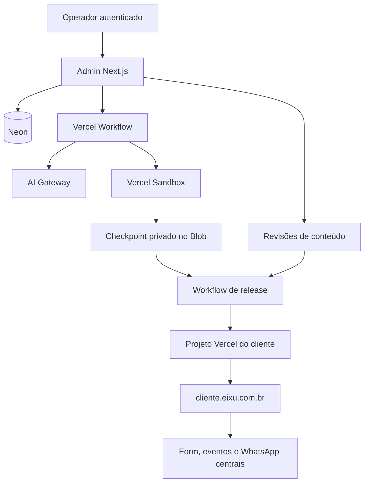

# Arquitetura do EIXU Studio

## Visão geral

A EIXU separa a plataforma de gestão dos projetos entregues aos clientes.

O projeto raiz hospeda institucional, painel, autenticação, APIs, Workflow e dados compartilhados. Cada cliente publicado tem um projeto Vercel dedicado. Não existe renderer central de blocos nem conversão Premium.

## Fronteiras de confiança

- A sessão resolve o operador no servidor.
- O tenant é carregado pelo slug e vinculado ao projeto antes de qualquer ação.
- Mensagens, anexos e metadata vindos do navegador são entrada não confiável.
- O modelo recebe um `toolsContext` criado pelo servidor e não escolhe tenant, Sandbox, credenciais ou projeto Vercel.
- Ferramentas de arquivo aplicam raiz fixa, normalização, limites de tamanho e rejeição de symlink.
- Comandos são nomes enumerados (`typecheck`, `build` e verificações previstas), nunca shell arbitrário fornecido pelo modelo.
- Publicação e reset são serviços determinísticos separados do agente.

O admin continua global para operadores ativos. Isolamento impede cruzar tenants acidentalmente; não representa papéis granulares por cliente.

## Modelo de dados

`db/schema.sql` é aditivo para instalações existentes. O reset remove as tabelas antigas depois de desconectar seus vínculos.

| Tabela                          | Papel                                                           |
| ------------------------------- | --------------------------------------------------------------- |
| `tenants`                       | Cadastro, contatos, marca e status do cliente.                  |
| `images`                        | Acervo numerado; uploads e gerações do Studio.                  |
| `studio_projects`               | Um projeto por tenant, Sandbox, host e ponteiros de revisão.    |
| `chat_messages`                 | `UIMessage` versionada, partes e metadata persistidas.          |
| `studio_runs` / `studio_events` | Execução do turno, Workflow, status e eventos ordenados.        |
| `studio_tool_leases`            | Exclusão mútua de efeitos retomáveis.                           |
| `studio_artifacts`              | Contexto, direção de arte e validação com versão e hash.        |
| `studio_source_evidence`        | Fonte consultada, resultado e evidência datada.                 |
| `studio_content_revisions`      | Contrato e valores imutáveis por revisão.                       |
| `studio_preview_sessions`       | Hash do token, URL limpa, revisão e expiração.                  |
| `studio_releases`               | Código, conteúdo, deployment e estado de ativação.              |
| `ai_usage`                      | Recibos por passo e por imagem, modelo servido, tokens e custo. |

IDs e constraints ligam cada recurso ao tenant/projeto. Revisões de conteúdo e artefatos são append-only. Ponteiros em `studio_projects` indicam o draft e a release ativa.

## Conversa e execução

`POST /api/chat` recebe exatamente uma nova mensagem, autentica, limita o corpo pelos bytes realmente lidos, valida partes e anexos, persiste o pedido, cria `studio_runs` e inicia `studioTurnWorkflow`. O histórico enviado pelo cliente é ignorado como autoridade; o servidor carrega a conversa canônica.

`WorkflowAgent` transmite `ModelCallStreamPart` por Workflow. `/api/chat/[runId]/stream` exige operador ativo, aceita somente um Workflow registrado em `studio_runs` e retoma do índice recebido pelo transporte. O admin é global, como no restante do produto. Ao concluir, um step recompõe a `UIMessage`, registra uso e encerra o run. Falhas e cancelamento também viram mensagens e estados persistidos.

Um índice único permite somente um run ativo por projeto. Tool leases impedem repetir efeitos concorrentes dentro de retomadas.

## Workspace e Sandbox

O projeto começa em um scaffold mínimo com Next.js, TypeScript, conteúdo versionado e integrações da EIXU. `package.json`, `project.json`, `proxy.ts`, `lib/eixu.ts`, `tsconfig.json`, `next.config.ts` e `.gitignore` são arquivos protegidos. `package-lock.json` só pode nascer do `npm install` controlado e não pode ser escrito pelo agente. `next-env.d.ts` é gerado pelo Next.js, fica ignorado e não participa do digest. O checkpoint compara os arquivos reservados com o scaffold esperado, rejeita symlinks e só arquiva o projeto depois dos gates.

O Sandbox usa egress restrito e não recebe credenciais administrativas. O manifesto fixa Next.js, React, TypeScript e os scripts de build; a primeira versão não aceita dependências adicionais. A instalação usa `--ignore-scripts`. Seu estado é reconstruível: o código validado é compactado e salvo em Blob privado com revisão SHA-256. A coluna `draft_code_revision` aponta ao checkpoint atual; restaurar seleciona exatamente esse artefato.

Restauração verifica o SHA-256 antes de extrair o checkpoint e executa `npm ci` quando o lockfile existe. A prontidão das dependências exige o digest de manifesto/lockfile e os executáveis Next.js/TypeScript; a presença do lockfile sozinha não basta. A primeira instalação gera o lockfile com `npm install`.

Imagens públicas em `tenants/` usam `BLOB_READ_WRITE_TOKEN`. Checkpoints e screenshots de referência em `studio/` usam um store separado configurado como privado, selecionado por `STUDIO_BLOB_STORE_ID` e autenticado pelo OIDC curto da Vercel. Upload, leitura, listagem e exclusão recebem a identidade do store explicitamente. O SDK não recebe credenciais Blob dentro do Sandbox.

## Preview

A prévia só nasce de checkpoint válido. O Sandbox inicia o servidor do projeto com um token aleatório de alta entropia. O `proxy.ts` protegido exige o token na primeira navegação e o troca por cookie HTTP-only, Secure, SameSite=None e Partitioned.

A rota relê código e conteúdo sob o lock do projeto e recusa runs ativos. Antes de abrir a prévia, encerra o dev server, remove fontes/cache do rascunho anterior, restaura o checkpoint verificado e sobrepõe exatamente a revisão de conteúdo solicitada. Arquivos de turnos falhos ou cancelados não podem aparecer como parte de um checkpoint anterior.

O banco armazena apenas o hash, a URL sem query e uma expiração curta. A resposta recebe `noindex`, política de referrer e `frame-ancestors` limitado à plataforma. Expiração gira o token e reinicia o servidor quando necessário.

Em produção do cliente, `EIXU_PREVIEW_TOKEN` não existe e o mesmo proxy permite tráfego normal.

## Conteúdo e CMS

Cada projeto declara `content/schema.json` e `content/values.json`. O servidor valida schema, tipo, tamanho, revisão e hash antes de salvar. Toda alteração cria nova `studio_content_revisions`; uma escrita nunca modifica a revisão anterior.

O chat altera código e contrato. O CMS leve altera somente valores previstos. Publicação fixa uma revisão de conteúdo e um checkpoint de código, evitando combinar duas versões diferentes durante o build.

## Release por cliente

A release usa um projeto `eixu-site-{slug}` dentro do time configurado. Os IDs do time e do projeto raiz vêm do ambiente; não são constantes no código.

Fluxo:

1. criar a release e salvar o artefato privado;
2. assegurar o projeto dedicado, confirmar que nunca é o projeto raiz e exigir proteção Vercel Auth em `preview`;
3. materializar os arquivos com a revisão de conteúdo congelada;
4. enviar cada arquivo à API `/v2/files` por SHA-1 e criar o deployment com referências de digest;
5. aguardar `READY`, criar um bypass de automação efêmero, verificar o marcador de revisão e as páginas e revogar o bypass;
6. adicionar o domínio canônico ao projeto correto;
7. promover o deployment candidato;
8. repetir o smoke no host canônico;
9. ativar release e ponteiros em transação.

O bypass existe apenas durante o smoke do candidato e é revogado também quando a verificação falha. O domínio canônico público nunca recebe o bypass: seu smoke comprova acesso real depois da promoção. O reconciliador registra a intenção antes da promoção e cobre a janela em que a Vercel pode ter promovido o deployment antes de a gravação no banco terminar. O marcador servido pelo host canônico é a prova final. Rollback cria uma nova release pelo mesmo pipeline. Arquivar remove o domínio; restaurar promove a release ativa e verifica o host; excluir remove somente o projeto dedicado comprovado.

## Integrações públicas

O scaffold usa `lib/eixu.ts` para formular ação de formulário, evento e WhatsApp. Na plataforma:

- `/api/form` registra leads;
- `/api/e` registra eventos;
- `/go/wa` registra atribuição e redireciona ao WhatsApp.

As rotas validam host/origin, payload e limites. O redirecionamento do formulário é resolvido contra o host canônico e recusa mudança de origem. O tenant precisa estar publicado, com projeto não arquivado e release ativa pertencente a esse projeto. Edição, validação ou falha do rascunho não desativam formulário, eventos ou WhatsApp da release já publicada. Atribuição é limitada por forma e tamanho.

O `proxy.ts` da plataforma não tenta renderizar sites de clientes no projeto raiz. Hosts wildcard sem projeto dedicado recebem 404.

## Imagens

Uploads são validados por tipo real, pixels, tamanho e tenant; depois são normalizados para WebP e entram no acervo. Imagens geradas usam AI Gateway, idempotency key, caminho determinístico no Blob e uma chave única própria do Studio. `batch_id` antigo permanece não único para que a migração seja compatível.

Cada chamada registra primeiro um recibo `pending`; sucesso grava `recorded`, metadados do Gateway e custo, e falha grava `failed`. Se o Workflow retomar depois de salvar a imagem, a chave do pedido recupera o mesmo item.

## Reset controlado

`scripts/reset-sites.mjs` opera em modo manifesto por padrão. O escopo inclui dados de sites, prefixo Blob `tenants/` no store público, `studio/` no store privado e projetos Vercel identificados no banco ou pelos prefixos `eixu-site-` e `eixu-premium-`. O manifesto v2 inclui o modo de acesso e ID de cada store no digest, sem tokens; mudar de store invalida o aceite. O projeto raiz é excluído do conjunto e cada ID/nome remoto é conferido novamente antes da remoção.

Execução requer ambiente explícito, confirmação textual, digest do manifesto, fingerprint do banco, timestamp de manifesto com no máximo 30 minutos, deployment raiz READY e referência de recuperação. A manutenção é ativada antes da primeira remoção. Em falha após esse ponto, permanece ativa para evitar recriação até intervenção. Operadores, autenticação, Kanban e atividade de acesso/Kanban são preservados; referências de cards a tenants viram nulas.

Como Neon, Blob e Vercel não compartilham transação, todas as etapas produzem recibos e a verificação final prova contagem zero e ausência dos recursos inventariados.

## Limites atuais

- A integração real precisa de permissões para projeto, deployment, domínio, Blob, Sandbox e Gateway no time escolhido.
- O código local não prova continuidade de Workflow ou Sandbox na conta da Vercel.
- O reset não foi executado por esta implementação.
- Não há portal de cliente nem RBAC por tenant.
- Sites com autenticação, pagamento ou backend próprio ficam fora do Studio inicial.
