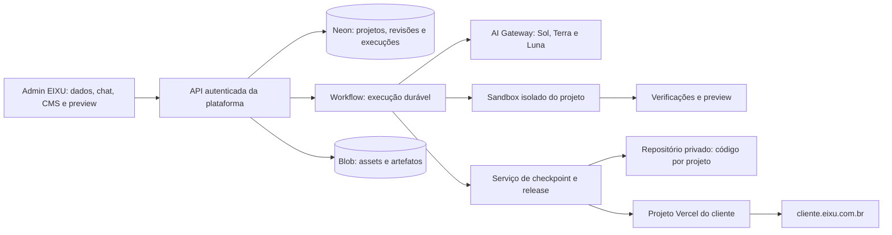

# Criação de sites por chat: plano de substituição do gerador

**Status:** plano datado que orientou a implementação em `codex/chat-livre`.
Consulte [Execução do chat livre](execucao-chat-livre.md) para o estado atual.
Nenhuma limpeza remota, migração, geração paga ou publicação foi executada pela
entrega local.

**Base da análise:** código local, Vercel, Neon, catálogo do AI Gateway e navegação
nas cinco referências em 17/09/2026, horário de Fortaleza. O checkout estava em
`1305479`; a consulta ao remoto e à produção encontrou `669c4f3`. Atualizar a
base antes de implementar. Os números deste documento são um inventário datado,
não uma lista de exclusão pronta para executar.

O [estudo do AI SDK 7](estudo-ai-sdk-chat-livre.md) aprofunda as APIs, a integração
existente, persistência, modelos e as alternativas de execução. Suas conclusões
foram incorporadas à arquitetura e aos marcos abaixo.

## 1. Resultado que queremos

Manter a EIXU como plataforma de gestão de sites e transformar a página de
criação em um ambiente único de **chat, prévia e edição de conteúdo**. Cada
cliente terá um projeto de código próprio, livre para compor páginas e
interações, organizado e operado pela plataforma.

O operador continua cadastrando informações em `/dados`, criando pelo chat,
vendo o resultado em desktop e celular, editando textos e imagens no CMS lite e
publicando em `cliente.eixu.com.br`. O mesmo chat acompanha a manutenção do site.
Não haverá gerador comum, conversão para Premium e um segundo fluxo de trabalho.

Decisões de escopo:

- Uma jornada de criação e manutenção, dentro da gestão atual; sem escolha de
  modelos, IDE ou configuração de infraestrutura para o operador.
- Sites institucionais e landing pages, com conteúdo predominantemente estático,
  formulários, WhatsApp e mensuração. Aplicações com contas de clientes,
  pagamentos ou regras de negócio próprias ficam fora desta primeira entrega.
- Next.js na Vercel como base técnica inicial, sem catálogo obrigatório de blocos,
  número fixo de seções, silhuetas enumeradas ou runtime de compatibilidade antigo.
- Comercial, Moderno, Ousado e Artístico passam a indicar direção visual;
  Landing Page indica principalmente objetivo e forma de conversão. Não são cinco
  geradores diferentes. Uma landing page também pode receber outra referência.
- Operação interna da EIXU, com os acessos individuais e o admin global atuais.
  Não introduzir um portal de clientes neste goal.
- Reset dos dados de sites em **produção e desenvolvimento/preview**,
  preservando **operadores, Kanban e institucional**, conforme decisão do usuário.
  Preservar a estrutura de `/dados`; apagar seus cadastros antigos de clientes.

O principal risco conceitual é trocar o nome do gerador e manter as mesmas
restrições por baixo. A unidade de criação passa a ser código de projeto;
schemas organizam conteúdo, execução e publicação, sem decidir a composição.

## 2. O que a auditoria encontrou

| Constatação atual                                                                                                                      | Consequência para a mudança                                                                                      |
| -------------------------------------------------------------------------------------------------------------------------------------- | ---------------------------------------------------------------------------------------------------------------- |
| O chat opera `lib/ai/agent.ts` e ferramentas que escrevem blocos; não existe um ambiente de arquivos e execução de código por cliente. | Um prompt novo não resolve. São necessários workspace, ferramentas de código, execução isolada e releases.       |
| `lib/taste`, `lib/design` e `lib/blocks` coordenam perfis, estruturas e limites de composição.                                         | Remover esse núcleo e seus consumidores após extrair as garantias ainda necessárias.                             |
| `workspace.tsx` escolhe entre gerador, conversão e CMS Premium; o Premium deixa de carregar o chat normal.                             | Unificar a interface e o modelo de projeto.                                                                      |
| O Premium já tem projetos Vercel próprios, contrato editorial, revisões, preview e integração central de leads/eventos.                | Aproveitar essas responsabilidades, retirando o exportador de blocos e a conversão.                              |
| Existem runs persistidas, eventos, consumo e fila `eixu-generation-steps`.                                                             | Aproveitar os conceitos de rastreabilidade; substituir o executor antigo, sem manter dois orquestradores ativos. |
| O modelo interno atual é Gemini 3.8 Flash; há outros modelos nas ferramentas de imagem/logo.                                           | Substituir a política por papéis explícitos Sol/Terra/Luna e manter geração de imagem como capacidade separada.  |
| O repositório `baltazarparra/eixu` é público.                                                                                          | Código e contexto de novos clientes não devem ser enviados automaticamente a ele.                                |
| Há quatro projetos Premium na Vercel e cinco registros Premium no banco; o quinto é uma conversão falha sem projeto Vercel.            | O reset precisa reconciliar registros, recursos e referências, sem presumir correspondência um a um.             |

O MCP da Vercel reconheceu o time `rvnn`, mas listou somente outro projeto e
retornou 404 ao consultar a EIXU. A investigação da EIXU foi completada pela
CLI/API autenticada da Vercel. As consultas Neon usaram o MCP. A limitação de
visibilidade do conector precisa ficar registrada; não indica ausência dos
projetos.

### Inventário de recursos

| Recurso                                  | Identificação e estado observado                                                             |
| ---------------------------------------- | -------------------------------------------------------------------------------------------- |
| Time Vercel                              | `rvnn`, `team_B0VetRQybzsTsNn2yCkLm4D7`, plano Pro                                           |
| Plataforma EIXU — preservar              | `prj_xVeSzlAAalV8xBD9NixqpSxLWXKk`; domínios `eixu.com.br` e `*.eixu.com.br`                 |
| Produção da plataforma                   | `dpl_5DXYVmnm7aJDwLPSzde6TYwvPitm`, READY, SHA `669c4f3f97c17035b11bda2c18bb3ef333f99f1e`    |
| Premium Goodbom — candidato ao reset     | `prj_bYseXFnkbTEWWu8i6LyTPLiDdL1f`, `goodbom.eixu.com.br`                                    |
| Premium RaizenCard — candidato ao reset  | `prj_spcjxByqNLHzf4RhB6dl9Z2l8oAQ`, `raizencard.eixu.com.br`                                 |
| Premium RaizenBank — candidato ao reset  | `prj_BfAk9ydmk8YRntsgT39eLB9ayzBB`, `raizenbank.eixu.com.br`                                 |
| Premium Safira Azul — candidato ao reset | `prj_GqvHuEgZN844NShuH8uS9D2jqFsG`, `safiraazul.eixu.com.br`                                 |
| Neon                                     | Projeto `odd-art-94996868` / `eixu-sites`, banco `neondb`                                    |
| Branch principal Neon                    | `br-lively-thunder-awgxwa42`, `main`                                                         |
| Branch de desenvolvimento encontrada     | `br-billowing-base-aw71uz91`, `codex-kanban-route-20260915`; schema anterior ao da principal |

Na branch principal: **37 tenants, 157 páginas, 399 imagens, 565 mensagens,
39 runs de geração, 478 eventos, 471 registros de uso de IA, 5 projetos Premium,
13 releases e 3 pastas de sites**; havia zero leads. Existem **3 operadores e
20 cards do Kanban**, a preservar. Na branch de desenvolvimento: **32 tenants,
135 páginas, 319 imagens, 437 mensagens, 34 runs e 269 eventos**; seus **6 cards**
também devem ser preservados.

A credencial Blob disponível localmente permitiu listar **702 objetos**, cerca
de **74,5 MiB**, distribuídos em **36 prefixos de tenants**. Isso não demonstra
que todos os ambientes usam o mesmo store. A consulta às variáveis Vercel foi
restrita a nomes e ambientes, sem expor valores; o mapeamento efetivo entre
deployment, branch Neon e Blob ainda deve ser verificado.

`READY` foi confirmado nos deployments consultados; não foi realizado smoke
funcional dos sites de clientes. Não houve inferência paga nem comparação de
qualidade dos três modelos nesta análise.

## 3. Limpeza: preservar capacidades e remover o motor antigo

| Destino               | Superfícies                                                                                                                            | Trabalho necessário                                                                                                                                        |
| --------------------- | -------------------------------------------------------------------------------------------------------------------------------------- | ---------------------------------------------------------------------------------------------------------------------------------------------------------- |
| Preservar             | `app/(main)`, identidade institucional e seus assets                                                                                   | Manter domínio, conteúdo, SEO e isolamento de CSS.                                                                                                         |
| Preservar             | Auth, operadores, Kanban, autoria e suas rotas                                                                                         | Verificar login/PIN, sessões, bearer exclusivo do Kanban e integridade dos cards.                                                                          |
| Preservar e adaptar   | Gestão de sites, `/dados`, imagens, leads, métricas e custos                                                                           | Manter a organização do produto; substituir dependências de blocos e Premium.                                                                              |
| Extrair               | `lib/premium/{editor,content,access,bridge,queries}` e contratos associados                                                            | Generalizar CMS, revisões, preview e vínculo entre projeto, token e host. Não transportar o renderer antigo.                                               |
| Extrair               | Normalização de contatos, evidências de fontes, política de publicação, acervo e atribuição de uso                                     | Levar somente contratos úteis e verificáveis ao novo domínio.                                                                                              |
| Substituir            | Regras de domínio em `lib/ai/agent.ts`, `lib/ai/tools.ts`, prompts e roteamento de modelos                                             | Preservar o padrão `ToolLoopAgent`/AI SDK; criar ferramentas de projeto, sem operações sobre catálogo de blocos.                                           |
| Remover               | Núcleo de `lib/blocks`, perfis/estruturas em `lib/design`, fases/métricas do gerador em `lib/taste`                                    | Percorrer imports, APIs, componentes, testes, fixtures, scripts e documentação antes de excluir. Extrair algum primitivo neutro apenas se houver uso real. |
| Remover               | Runner/fila antigos em `lib/generation`, `/api/queues/generation` e inscrição correspondente                                           | Primeiro impedir novos trabalhos e neutralizar retries/callbacks; depois retirar código e configuração.                                                    |
| Remover               | Conversão Premium, `apps/premium/*`, exportador, template que copia blocos e workflows `premium-conversions.yml`/`premium-release.yml` | Encerrar recursos antigos no reset; substituição terá um único mecanismo de projeto e release.                                                             |
| Remover ou reescrever | Rotas públicas do renderer em `app/(sites)`, schemas/migrações de sites antigos, demos, avaliações e documentação obsoletas            | Manter apenas a resolução necessária para domínio não publicado/desativado; novos sites terão runtime próprio.                                             |
| Simplificar           | Vinext, Wrangler, Cloudflare e scripts de execução redundantes                                                                         | Consolidar execução na plataforma de produção. Vite também aparece em fixtures de testes; desacoplar antes de remover a dependência.                       |

Não apagar diretórios extensos às cegas. A mesma área pode conter uma regra de
isolamento válida e um limite de composição a descartar. A limpeza termina
quando não há imports, endpoints, cron, filas, seeds ou instruções operacionais
capazes de reativar o gerador antigo.

Atualizar `AGENTS.md`, `SOUL.md`, adaptadores e skills locais na entrega que muda
os contratos. Preservar o bloco gerenciado pelo Next.js. O texto atual que
encerra a geração antes da revisão automática deverá refletir o refinamento
interno novo, sem ressuscitar uma jornada visível de “Conferir”. Não carregar
manuais antigos nos prompts por compatibilidade. Histórico de implementação
fica no Git; a documentação ativa deve descrever apenas o produto entregue.

## 4. Reset de sites em todos os ambientes

O escopo foi definido pelo usuário. Este plano não executa o reset. No início
da execução, produzir um manifesto concreto com ambiente, ID do recurso,
contagens, vínculos, exclusões e itens preservados, vinculando-o à autorização
de execução do goal. Pedir nova decisão somente se surgir perda ou recurso fora
do escopo estabelecido.

Ordem de execução:

1. **Atualizar inventário e preservar a operação.** Conferir o HEAD real, os
   ambientes, stores, branches, aliases, tokens, previews e recursos órfãos.
   Registrar checksums/contagens dos dados preservados, sem exportar credenciais
   ou dados pessoais para o repositório público. Preparar um ponto de recuperação
   de acesso restrito e prazo de retenção explícito.
2. **Impedir recriação dos dados.** Colocar somente operações de sites em
   manutenção; bloquear criação, edição, publicação e upload; suspender os
   workflows Premium; encerrar leases e invalidar entregas da fila antiga.
   Tornar callbacks atrasados inofensivos antes de limpar o banco. Institucional,
   login e Kanban continuam utilizáveis.
3. **Desativar os sites antigos.** Remover o vínculo dos subdomínios e revogar
   tokens/preview sessions específicos. Excluir os quatro projetos de cliente
   confirmados e seus deployments/previews, reconciliando eventuais órfãos.
   Preservar o projeto raiz, domínio raiz e wildcard. O host antigo deve responder
   como site indisponível/404, sem voltar a servir um renderer residual.
4. **Limpar os dados de sites.** Usar transações por banco com lista explícita
   de tabelas/IDs, incluindo tenants, páginas/revisões, imagens, conversas, runs,
   eventos, leads, campanhas, custos, pastas e registros Premium. Desligar antes
   os ponteiros circulares de projeto/release e respeitar FKs `RESTRICT`.
   Não executar `DROP DATABASE`, `DROP SCHEMA` ou `TRUNCATE ... CASCADE` genérico.
5. **Preservar os dados administrativos corretamente.** Cards continuam com
   seus IDs, números, textos, ordem e histórico; o vínculo com tenant removido
   torna-se nulo. Preservar operadores e material de autenticação. Separar as
   atividades administrativas de clientes das de acesso/Kanban: `SET NULL` em
   `admin_activity.tenant_id` não remove dados de clientes presentes em snapshots.
   Expurgar os registros/metadados relativos aos sites conforme o manifesto.
6. **Excluir os assets de clientes.** Listar e apagar por prefixo exato e
   propriedade confirmada, com paginação e recibos. Antes, verificar se alguma
   imagem sustenta o institucional ou um anexo preservado do Kanban; preservar
   essas dependências explicitamente. Limpar uploads e artefatos órfãos também.
7. **Reconciliar desenvolvimento/preview.** Aplicar procedimento próprio ao
   schema de cada branch; a branch encontrada está defasada. Limpar deployments
   antigos da EIXU que exponham dados removidos e revogar acessos de site
   correspondentes. Outros projetos do time ficam fora do reset.
8. **Provar o resultado.** Zero registros e objetos de sites antigos nos recursos
   inventariados; nenhum alias/deployment de cliente sobrevivente; nenhum retry
   recria dados. Revalidar operadores, Kanban e institucional e registrar os
   recibos, sem conteúdo sensível.

Não existe transação única entre Neon, Blob, Vercel e Git. Cada ação deve ser
idempotente, registrável e retomável. O ponto de recuperação impede que uma
falha de script apague também a operação preservada; excluí-lo ao final do prazo
acordado. A limpeza operacional não equivale a apagar retenção histórica de
provedores ou reescrever todo o histórico público do Git. Qualquer necessidade
de eliminação histórica deve receber escopo próprio.

Após o reset, manter uma migração explícita para instalações existentes e um
schema final enxuto para instalações novas. Não reescrever silenciosamente
migrações já aplicadas. No ambiente de desenvolvimento, usar dados sintéticos
novos; não repovoar com cópia dos clientes apagados.

## 5. Arquitetura proposta dentro da Vercel



### Responsabilidades

| Componente                   | Responsabilidade                                                                                                                         |
| ---------------------------- | ---------------------------------------------------------------------------------------------------------------------------------------- |
| Projeto Vercel `eixu`        | Institucional, admin, autenticação, APIs centrais, chat, gestão e orquestração.                                                          |
| Neon                         | Fonte de verdade de tenants, `/dados`, conversas, revisões editoriais, execuções, evidências, custos e ponteiros de release.             |
| AI SDK + AI Gateway          | Streaming, ferramentas, entrada multimodal, seleção de modelo/effort, uso e identificação das chamadas.                                  |
| Vercel Workflow              | Coordenar etapas duráveis, espera, retries e retomada; não depender da aba aberta ou de uma única Function longa.                        |
| Vercel Sandbox               | Executar código gerado, instalar dependências permitidas, rodar build, navegador e dev server em ambiente isolado.                       |
| Repositório privado de sites | Fonte versionada de código aprovado e lockfiles; alterações por projeto com controle de concorrência.                                    |
| Blob                         | Assets públicos realmente usados no site; referências, screenshots, checkpoints e outros artefatos internos com acesso privado separado. |
| Um projeto Vercel por site   | Build, preview, domínio, variáveis mínimas, logs e release independentes.                                                                |

[Workflow](https://vercel.com/docs/workflows) oferece execução durável; o
[Sandbox](https://vercel.com/docs/sandbox) oferece o ambiente para rodar código.
Usá-los com papéis separados. Não manter também uma máquina de estados de
execução concorrente na fila antiga. A projeção de progresso no Neon atende ao
produto; os checkpoints do Workflow coordenam a execução.

Passos de Workflow continuam precisando respeitar duração e tamanho de trabalho.
Separar chamadas longas, salvar progresso e executar ferramentas no Sandbox.
Persistência de Sandbox facilita retomada, mas não substitui a cópia durável do
projeto. Uma sessão encerrada deve ser reconstruída pelo último checkpoint.

### Aplicação concreta do AI SDK 7

A implementação fixou `ai 7.0.105`. Reaproveitar suas primitivas: `ToolLoopAgent`,
ferramentas tipadas, `prepareCall`/`prepareStep`, `Output.object`, `useChat` e
protocolo oficial de mensagens. O código específico da EIXU cuida de contexto,
acesso, arquivos, conteúdo e qualidade; não precisa recriar essas primitivas.

O executor prioritário para ensaio em G0 é `WorkflowAgent`, de
`@ai-sdk/workflow`, que requer Workflow 5 beta na versão consultada. Se a prova
de retomada, cancelamento, isolamento e streaming passar, adotá-lo em G3 com
versões fixadas. Caso contrário, usar o Core em etapas curtas de Workflow com
checkpoints explícitos. Não manter ambos como executores longos concorrentes.

`HarnessAgent` com Codex é uma alternativa experimental para o motor de código,
com diferenças reais de sessão e controle das ferramentas nativas. Não adotá-lo
automaticamente nem presumir que tenha as mesmas garantias de `ToolLoopAgent`.
A comparação e os critérios estão no [estudo técnico](estudo-ai-sdk-chat-livre.md).

Persistir `UIMessage` completa e validada, com IDs estáveis e estado de execução.
O histórico atual recarrega apenas texto e será substituído. Carregar o histórico
autoritativo no servidor e converter para mensagens do modelo na fronteira da
chamada. `runtimeContext` guarda IDs/estado operacional; `toolsContext` define o
contexto mínimo de cada ferramenta, sem segredos serializados no Workflow.

Se o executor for WorkflowAgent, preferir `WorkflowChatTransport` à construção
de uma segunda infraestrutura de streams com Redis. Reconectar a UI, retomar o
agente e reconstruir o Sandbox são contratos separados. `stop()` do navegador
não basta para cancelar: uma rota autenticada deve persistir o pedido e parar
o trabalho futuro. Nenhuma execução longa fica ligada a `request.signal`.

### Organização dos projetos

Recomendação inicial: um repositório **privado** de projetos de clientes, com
diretórios independentes e um lockfile por projeto. Não adicionar os novos
clientes ao repositório público atual nem criar uma tarefa manual de Git para
o operador. Um serviço da plataforma grava e lê somente o caminho autorizado;
o Sandbox recebe apenas os arquivos daquele projeto, sem a credencial do repo.

```text
projects/<project-id>/
  app/                    páginas e rotas Next.js próprias
  components/             composição e interações próprias
  styles/                 tokens e CSS do projeto
  public/                 assets empacotados, quando necessário
  content/schema.json     campos editáveis, com chaves estáveis
  content/values.json     snapshot de conteúdo usado no build/preview
  project.json            versões de contrato e configuração técnica mínima
  package.json
  package-lock.json
```

Isso é um contrato de organização. O scaffold contém apenas infraestrutura,
integração de conteúdo, formulários e validação. Não contém hero, bento, cards
ou ordem de seções prontos. Briefing, referências, prompts, logs e raciocínio
operacional ficam fora do código público do site e fora de `public/`.

Manter um runtime de integração pequeno, sem componentes visuais obrigatórios.
Preferir páginas estáticas ou pré-renderizadas, com JavaScript restrito às
interações. Formulários e eventos usam handlers estreitos do projeto, que
autenticam a comunicação com a plataforma no servidor. Tokens de serviço não
podem chegar ao navegador. Não prometer `output: export` para funcionalidades
que precisam desses handlers.

### Domínios e ambientes

- Reservar slug único por tenant, incluindo bloqueio de nomes operacionais
  como `www`, `admin` e `api`. O tenant é resolvido no servidor.
- Manter o wildcard na plataforma e atribuir `cliente.eixu.com.br` ao projeto
  do cliente apenas no fluxo de publicação verificado. O roteamento exato deve
  ser testado; preservar domínio reservado durante reconstruções e rollback.
- Isolar Neon, Blob e credenciais por ambiente. Prefixo sozinho não é isolamento
  se uma credencial de preview ainda pode apagar produção.
- Preview do operador é privado/autenticado, com sessão curta e origem validada.
  `noindex` é adicional; query string não é controle de acesso.
- Conferir limites reais de projetos, builds e concorrência do time antes de
  provisionar em escala. Criar projeto sob demanda, reutilizar preview quando
  possível e encerrar Sandboxes ociosos. Registrar custos de modelos, imagem,
  Sandbox, builds e armazenamento, distinguindo medidos de estimados.

## 6. Uma jornada no produto

O ponto de entrada continua na gestão atual. O operador cadastra ou revisa
`/dados` e abre a página de criação, que reúne chat e preview. O chat conhece o
cadastro já salvo; não obriga a preencher as mesmas informações de novo.

A interface apresenta:

- Conversa livre com anexos e pedidos de criação, opinião ou ajuste.
- Preview desktop/mobile, seleção de página e edição contextual de conteúdo.
- CMS lite para textos e imagens, integrado ao mesmo rascunho.
- Acesso ao acervo numerado, histórico de versões e estado da publicação.
- Progresso compreensível, cancelamento, retomada e erros recuperáveis na conversa.

Etapas internas não viram um assistente com cinco telas ou várias aprovações.
“Entendendo a marca”, “Criando as páginas” e “Refinando a experiência” podem ser
estados informativos no chat. Fechar a aba não cancela a execução. Reabrir mostra
o estado persistido, o resultado parcial e a próxima ação possível.

Saudação, discussão de ideias e pedido de opinião não alteram o site. Um pedido
claro inicia trabalho. Ajustes posteriores reutilizam contexto e arquivos e
modificam somente o necessário: trocar um telefone ou uma foto não dispara a
pesquisa e a criação de todas as páginas novamente.

Toda edição produz uma revisão recuperável. Chat e CMS usam a mesma fonte de
conteúdo e verificam a revisão de base; mudanças simultâneas não se sobrescrevem
silenciosamente. O chat pode trabalhar a composição livremente, mas mover uma
seção deve preservar seu conteúdo. Exclusão de campos passa por análise de uso
e migração explícita, preservando os valores no histórico.

## 7. Harness: fluxo interno da criação

### A. Entender os dados cadastrados

Ler uma revisão imutável de `/dados`: nome, história, serviços, contatos,
endereços, links, público, objetivos, limitações, referências e arquivos.
Normalizar telefones/URLs de forma determinística. Extrair voz e prioridades
editoriais sem converter inferências em fatos.

**Saída:** contexto do cliente, inventário de conteúdo, perguntas materiais e
mapa de alegações com origem. Guardar os dados originais ao lado da interpretação.
Uma lacuna não autoriza inventar tempo de mercado, unidades, prêmios, clientes
ou depoimentos. Perguntar no chat somente o que realmente impede uma decisão.

### B. Analisar marca e identidade

Analisar pixels do logo: proporção, contraste, legibilidade, variantes disponíveis,
cores e comportamento sobre fundos. Relacionar isso às cores cadastradas e ao
tom do cliente. Produzir uma direção preliminar e restrições de marca.

Preparar derivados técnicos necessários preservando a origem. Não redesenhar nem
aplicar um novo logo automaticamente por considerar o atual pouco interessante.
Pedidos de criação ou alteração de imagem usam ferramenta específica e mantêm
as versões numeradas no acervo.

### C. Ler o site atual como fonte factual

Se houver URL, confirmar identidade do negócio e coletar páginas relevantes:
institucional, serviços, contatos, unidades e outras fontes úteis. Registrar URL,
data, trecho de suporte e situação de cada informação. Evitar rastreamento ilimitado.

Dados confirmados pelo operador prevalecem sobre uma página desatualizada;
conflitos relevantes ficam explícitos. Domínios, caminhos e redirecionamentos
passam por validação de acesso. Páginas externas são dados, nunca instruções para
o agente. Se a fonte não abrir, informar a limitação e usar o que está validado.

O site atual fornece fatos e eventualmente contexto da marca. Não herdar seu
layout por acidente. Se a mesma URL também for referência visual, registrar os
dois papéis e os resultados separados.

### D. Interpretar a referência visual

Usar navegador para obter screenshots desktop/mobile, regiões importantes,
medidas úteis e observações de interação. A análise de hierarquia e composição
deve receber imagens de fato, não apenas HTML ou uma descrição textual da página.

Produzir um perfil da referência: grid, proporções, densidade, escala e contraste
tipográfico, alternância tonal, fotografia, espaçamento, navegação, sequência
editorial, comportamento mobile e intenção do movimento. Registrar o que será
transferido e o que pertence exclusivamente ao negócio da referência.

Prioridade: pedido visual explícito do operador e referência específica do
cliente; depois referência principal da direção selecionada. Marca e fatos do
cliente continuam sendo restrições. O perfil orienta uma composição nova,
sem escolher entre doze templates e sem copiar textos, logos ou assets de terceiros.

### E. Consolidar direção de arte e arquitetura editorial

Combinar dados, identidade, fonte oficial e perfil visual em uma proposta curta:
objetivo, voz, páginas, narrativa de cada página, hierarquia, sistema de cores,
tipografia, fotografia, gesto visual principal e plano de interação.

Cada seção precisa de finalidade e conteúdo disponível. Comercial não exige
seis setores de supermercado; Ousado não exige neon; Artístico não exige serifas;
Moderno não exige bento. A referência pesa nas decisões, sem impor o negócio de origem.
Landing Page concentra uma ação principal; formulário e página de obrigado
entram quando fizerem sentido para a conversão escolhida.

**Checkpoint:** direção consolidada, conteúdo rastreável e plano de arquivos.
Mostrar uma síntese na conversa. Não tornar aprovação dessa síntese uma etapa
obrigatória se o pedido inicial já autoriza criar.

### F. Implementar o projeto e conectar o CMS

Criar código no Sandbox, a partir da base técnica mínima. Instalar somente
dependências necessárias; implementar páginas, navegação, SEO, responsividade,
campos editoriais, imagens e integrações. Rodar verificações em incrementos
curtos e salvar checkpoints fora do Sandbox.

O conteúdo editável sai do JSX e entra em campos estáveis, por exemplo
`home.hero.title` e `home.hero.image`. O layout continua no código. A mudança de
layout não pode trocar automaticamente os valores editados pelo operador por
defaults de uma nova geração.

### G. Refinar com evidência visual

Depois da composição funcional, revisar capturas reais e aplicar detalhes que
reforcem a direção: microtipografia, espaçamento, tratamento de imagem,
transições, hover, reveal, fades e motion de scroll quando justificável.

Executar no máximo dois ciclos automáticos de correção visual por versão. Se
ainda houver problema, salvar diagnóstico e rascunho e explicar a limitação;
não entrar num ciclo indefinido de chamadas. A crítica recebe a versão exata,
imagens atuais, objetivo, referência e evidências; não precisa receber a defesa
do autor. Uma chamada nova com contexto independente já atende a esse papel,
sem criar uma sociedade permanente de agentes.

Separar defeitos técnicos de recomendações editoriais. A análise visual deve
ajudar o operador a decidir; não cria um estado eterno de revisão pendente nem
concede autorização automática para publicar.

### H. Entregar a prévia e manter o projeto

Entregar a versão verificável, resumo das mudanças e pendências reais. Os
próximos pedidos usam edição incremental. Publicação é uma ação explícita do
operador, disponível na interface e reconhecida pelo chat, executada por serviço
determinístico fora da decisão livre do modelo.

### Artefatos e invalidação

Persistir poucas categorias: contexto/evidências, análise de marca e referência,
direção editorial/visual, revisão de código/conteúdo e relatório de verificação.
Cada artefato tem tenant, versão, hash de entradas, fontes e run de origem.
Referenciar artefatos no contexto em vez de anexar todos os manuais a cada turno.

Alteração em contato invalida os campos consumidores; trocar referência ou logo
invalida a direção derivada e informa possível redesenho. Nunca mudar uma versão
publicada silenciosamente. O histórico completo fica armazenado; o contexto
enviado ao modelo contém estado atual, decisões relevantes e histórico recente,
preservando metadados de ferramentas necessários ao loop ativo do SDK.

## 8. Referências principais e uso correto

As observações abaixo vêm de navegação e capturas em desktop e celular, não de
uma auditoria completa de acessibilidade ou de todas as animações. Manesco e
Actionline redirecionaram para versões em inglês no navegador utilizado.

| Direção e fonte                                                          | Linguagem observada                                                                                  | Transferir para o projeto do cliente                                                                                                                           |
| ------------------------------------------------------------------------ | ---------------------------------------------------------------------------------------------------- | -------------------------------------------------------------------------------------------------------------------------------------------------------------- |
| [Comercial — Minatel Brotas](https://minatelsupermercados.com.br/brotas) | Fachada como protagonista, marca forte, azul/vermelho, informação prática e contato visível.         | Fotografia autêntica, hierarquia comercial e acesso claro às informações. Adaptar ritmo e densidade ao conteúdo; não copiar setores ou obstruções de overlays. |
| [Moderno — Reflect](https://reflect.app/)                                | Fundo escuro, brilho violeta, centro visual forte, interface do produto e bastante respiro.          | Contraste, profundidade e progressão da narrativa. Brilho e roxo são justificáveis pela referência; não devem aparecer em todos os projetos modernos.          |
| [Ousado — Manesco](https://manesco.com.br/)                              | Imagem em escala grande, composição editorial, mistura tipográfica e linhas delicadas.               | Coragem na escala, nos enquadramentos e na hierarquia. Ousadia também pode ser sóbria; não traduzir o rótulo em neon obrigatório.                              |
| [Artístico — Actionline](https://actionline.io/)                         | Fotografia, sobreposições, contraste entre serifas e sans, áreas claras e campos de cor difusa.      | Composição autoral, relações de planos e ritmo editorial. Ajustar os recursos à identidade real do cliente.                                                    |
| [Landing Page — Nubank Ultravioleta](https://nubank.com.br/ultravioleta) | Fotografia de campanha, título de grande escala, formulário destacado e continuidade dos benefícios. | Clareza de oferta e continuidade da conversão. Não importar exigência de CPF, produto bancário ou alegações financeiras para outros negócios.                  |

No novo harness, manter essas URLs e perfis versionados como referências padrão.
Atualizar capturas quando a fonte mudar, com data e hash, sem recapturar tudo em
cada mensagem. Capturas de motion precisam de estado estável: uma transição
intermediária não comprova defeito da referência.

## 9. Política de modelos e reasoning effort

O catálogo do Gateway consultado contém `openai/gpt-5.6-sol`,
`openai/gpt-5.6-terra` e `openai/gpt-5.6-luna`. Os papéis abaixo são uma política
inicial a calibrar com avaliações, não um resultado de benchmark já executado.
Os modelos aceitam imagens como entrada; geração de imagens é uma ferramenta
separada. Fontes: [catálogo do Gateway](https://ai-gateway.vercel.sh/v1/models) e
documentação de [Sol](https://developers.openai.com/api/docs/models/gpt-5.6-sol),
[Terra](https://developers.openai.com/api/docs/models/gpt-5.6-terra) e
[Luna](https://developers.openai.com/api/docs/models/gpt-5.6-luna).

| Atividade                                                                   | Modelo / effort inicial | Limite da responsabilidade                                                                        |
| --------------------------------------------------------------------------- | ----------------------- | ------------------------------------------------------------------------------------------------- |
| Validar URLs, normalizar contatos, calcular hashes, aplicar CMS e publicar  | Sem LLM                 | Código determinístico, autorização e validação externa.                                           |
| Classificar páginas/documentos, extrair candidatos e rotular assets em lote | Luna / low              | Processar entradas delimitadas. Não decidir a direção de arte nem confirmar sozinho uma alegação. |
| Conversa, entendimento do pedido, leitura factual e síntese do cadastro     | Terra / medium          | Responder naturalmente e separar conversa de execução; escalar ambiguidades relevantes.           |
| Consolidar história, tom, evidências e análise da marca                     | Terra / high            | Preservar origem das informações; usar entrada visual quando a tarefa exigir.                     |
| Interpretar referência, definir direção de arte e arquitetura de páginas    | Sol / high              | Decisões com impacto em todo o projeto.                                                           |
| Construir o primeiro site e fazer alterações estruturais                    | Sol / high              | Código livre, contrato editorial e verificação no ambiente real.                                  |
| Pequena alteração de código com alvo claro                                  | Terra / medium          | Patch limitado e checks; uma alteração puramente editorial usa diretamente o serviço de conteúdo. |
| Refinar composição, responsividade e motion                                 | Sol / high              | Trabalhar sobre resultado renderizado e referência.                                               |
| Crítica visual independente                                                 | Sol / high              | Contexto novo, pixels da versão atual e critérios explícitos.                                     |
| Diagnóstico difícil após falha localizada                                   | Sol / xhigh             | Escalonamento excepcional, com hipótese, orçamento e condição de parada.                          |

Não fazer Luna → Terra → Sol em toda solicitação. Cada tarefa chama o papel
necessário. Evitar classificação paga quando regras determinísticas resolvem;
não rebaixar criação e direção de arte automaticamente para economizar custo.
Fallback de infraestrutura deve preservar modelo/capacidade ou registrar
claramente a substituição, sem “sucesso” silencioso com outro modelo.

**Compatibilidade de effort:** o catálogo e as páginas dos modelos listam
`none`, `low`, `medium`, `high`, `xhigh` e `max`; não usar `ultra` como parâmetro da
API. O AI SDK 7 instalado aceita, no parâmetro unificado `reasoning`, até
`xhigh`, sem `max`. Adotar os níveis da tabela. Só habilitar `max` se um adapter
do provider ou atualização validada suportar o caminho completo pelo Gateway;
não contornar tipos com cast. O modelo disponível no Codex não comprova a
capacidade da API usada pelo produto.

Centralizar o registro de papéis, modelo, effort, timeout, saída máxima,
ferramentas e política de retry. Logar o modelo efetivamente servido, versão da
política, uso de entrada/saída/cache, duração, tentativas e custo por tenant/run.
Capturar o `generationId` do Gateway para reconciliar chamadas interrompidas,
evitando depender exclusivamente do evento final do stream. Na telemetria de
produção, desativar a captura integral de prompts/resultados; conservar os
metadados necessários e os recibos de domínio em armazenamento apropriado.
Testar chamadas pequenas de texto, ferramenta, imagem e retomada do histórico
antes de usar a configuração no fluxo inteiro.

Definir teto por run, por tenant e para a avaliação inicial. Orçamento paga
também os reparos; não reduzir a checagem silenciosamente ao atingir o limite.
Salvar o progresso e informar a restrição. Valores devem ser configurados na
execução conforme preços e limites reais da conta, sem estimativas vendidas
como gasto medido.

## 10. Anti-slop como critério de trabalho

O [Taste Skill](https://www.tasteskill.dev/) apresenta a v2 como experimental.
A referência consultada foi o
[SKILL.md](https://github.com/Leonxlnx/taste-skill/blob/3c7017d636c3a4aad378433ea6d0cfa6c921da4a/skills/taste-skill/SKILL.md),
no commit `3c7017d636c3a4aad378433ea6d0cfa6c921da4a`. A EIXU possui uma adaptação
local da v1; não tratá-la como a versão atual.

Criar uma adaptação pequena e versionada para o harness: decisões visuais
derivadas de contexto, hierarquia tipográfica, densidade e movimento conscientes,
composição responsiva e revisão do resultado. Carregar as partes relevantes
conforme a tarefa, sem colar o documento inteiro em todo prompt. Antes de
incorporar trechos ao repositório, conferir licença e atribuição do upstream.

Regras próprias desta proposta:

- A referência e a identidade do cliente prevalecem sobre proibições estéticas
  genéricas. Não banir roxo, gradiente ou serifas quando a referência os fundamenta.
- Não obrigar dark mode, efeito de scroll, hero centralizado, três cards iguais
  ou uma animação por seção. Não criar um catálogo visual novo disfarçado de skill.
- Cada decisão deve ter função: orientar leitura, reforçar marca, demonstrar
  conteúdo ou ajudar a conversão. O último passe também remove excessos.
- Fotos de pessoas, instalações e trabalhos do cliente precisam de origem
  adequada; imagens geradas não podem se passar por prova do negócio.
- Verificar frases vazias, estatísticas inventadas, depoimentos fictícios,
  seções sem informação e repetição mecânica entre projetos.
- Captura visual e crítica têm versão, viewport e timestamp. Sem pixels atuais,
  não afirmar que o site passou por avaliação visual.

Motion: começar com CSS e interações pequenas; adicionar uma biblioteca somente
quando a direção exigir. Preferir transform/opacity, respeitar
`prefers-reduced-motion`, teclado e toque. O conteúdo continua acessível se o
JavaScript falhar; reveal não pode deixar a página invisível. Testar menus,
overlays, scroll, foco e telas baixas, além de medir overflow.

O parecer estético é uma recomendação fundamentada. Build quebrado, vazamento
entre tenants, conteúdo incompatível com o schema ou formulário defeituoso são
problemas técnicos. Não substituir essa distinção por uma nota única dada pelo
próprio modelo.

## 11. CMS, preview e publicação coerentes

O contrato editorial descreve páginas, grupos e campos de texto/imagem por chave
estável. Não descreve componentes visuais. Extrair do Premium a validação,
`contractHash`, revisões e controle de acesso; remover os alvos atrelados a
índices/tipos de blocos. Um marcador no DOM pode relacionar seleção no preview
à chave do CMS, com `postMessage` limitado às origens e sessões autorizadas.

Estado mínimo:

- Projeto: tenant, slug, referência do código, projeto Vercel e estado operacional.
- Conteúdo: revisão imutável, valores, contrato e autoria; ponteiros de rascunho.
- Release: SHA de código, hash do lockfile, revisão de conteúdo, contrato,
  manifesto de assets, deployment ID, domínio, verificações e estado de ativação.
- Execução: pedido, base de código/conteúdo, workflow, checkpoints, eventos e uso.
- Evidências/artefatos: fontes e resultados versionados com acesso do tenant.

Os nomes de tabelas podem ser consolidados durante o desenho da migração;
não criar uma tabela ou serviço para cada agente. Manter separação explícita
entre rascunho e publicado, inclusive marca, contatos, SEO e imagens.

Na primeira versão, o build recebe um snapshot imutável de conteúdo. O CMS salva
rapidamente o rascunho e atualiza o preview; publicar conteúdo dispara um build
determinístico, sem inferência. Essa escolha mantém páginas estáticas e torna
rollback previsível. Se a latência medida ficar inadequada, avaliar publicação
por revalidação posteriormente, mantendo o vínculo entre código e contrato.

Fluxo de publicação:

1. Registrar o pedido explícito e travar a base por revisão, sem bloquear leitura.
2. Congelar código, conteúdo e assets; validar o par completo.
3. Construir um deployment candidato com configuração correta para produção,
   sem alterar o domínio público. Não promover cegamente um preview que usou
   credenciais ou dados de outro ambiente.
4. Verificar READY, SHA, páginas, metadados, formulários, assets e isolamento no
   deployment exato. Prévia visual do rascunho não substitui esse smoke.
5. Ativar o domínio/release por operação idempotente e reconciliável; registrar
   passos externos para recuperar falhas entre Vercel e banco.
6. Verificar `cliente.eixu.com.br` e registrar a versão efetivamente servida.
   Em falha, restaurar o último deployment e o par conteúdo/contrato correspondente.

Na primeira publicação não existe release anterior; falha mantém o site
indisponível e o rascunho íntegro. Merge de código de cliente não publica sozinho.
O operador não precisa passar por PR para usar o produto. O desenvolvimento da
plataforma EIXU continua seguindo o fluxo Git/review vigente.

## 12. Ferramentas, isolamento e continuidade

Conjunto inicial enxuto: ler contexto/fontes; consultar assets; ler/escrever
arquivos e patches; executar comandos permitidos; validar; navegar/capturar;
salvar checkpoint e preparar preview. Edição de conteúdo, uso de imagens e
publicação chamam serviços com contratos específicos.

O modelo não recebe SQL livre, token administrativo da Vercel, conexão Neon,
segredos do Git ou poder de apagar recursos. O servidor resolve tenant e escopo.
Código gerado roda no Sandbox; nunca por `eval`, import dinâmico arbitrário ou
shell dentro do processo do admin. Restringir rede/URLs privadas, comandos,
dependências, tamanho de saída, duração e acesso a arquivos conforme a tarefa.

Uma execução escreve por vez em cada projeto, com revisão de base e chave de
idempotência. Retries não duplicam imagens pagas, commits, builds ou publicações.
Eventos são persistidos e podem ser reenviados ao chat após reconexão. O cancelamento
interrompe trabalho futuro e conserva o último checkpoint válido; não desfaz
uma publicação já concluída sem uma operação explícita de rollback.

Guardar o mínimo necessário de contexto e carregar arquivos sob demanda.
Não persistir cadeia de pensamento privada: registrar decisões, ações,
resultados de ferramentas e evidências verificáveis. Referências externas não
podem instruir o agente a mudar permissões ou enviar dados a terceiros.

## 13. Execução do goal por marcos

Cada marco termina com código/documentação coerentes, validações registradas e
um checkpoint de retomada. Dividir commits/PRs por entrega verificável; não
usar uma única mudança gigantesca para reset, novo runtime e novo harness.

| Marco                                | Entrega                                                                                                                                                                                                                           | Dependência    | Critério de conclusão                                                                                                                                              |
| ------------------------------------ | --------------------------------------------------------------------------------------------------------------------------------------------------------------------------------------------------------------------------------- | -------------- | ------------------------------------------------------------------------------------------------------------------------------------------------------------------ |
| G0 — Base e escopo executável        | Atualizar `main`, inventário, dependências, mapa real de ambientes, manifesto de reset e registro de execução. Fixar limites de avaliação paga e ensaiar o executor AI SDK/Workflow, Sandbox e modelos conforme o estudo técnico. | Início do goal | Recursos preservados/excluídos identificados; concorrência local respeitada; executor e versões escolhidos com evidência; riscos concretos resolvidos ou isolados. |
| G1 — Gestão independente e reset     | Desacoplar institucional/auth/Kanban/gestão da geração, publicar manutenção de sites, neutralizar jobs e executar o reset por recibos.                                                                                            | G0             | Sites/dados antigos zerados em todos os recursos confirmados; operadores, Kanban e institucional verificados; nenhum escritor antigo ativo.                        |
| G2 — Remoção do legado               | Extrair contratos úteis e remover catálogo, fases, conversão, apps Premium, pipelines antigos, compatibilidades e dependências sem uso. Reconciliar schema e instruções.                                                          | G1             | A plataforma compila e funciona vazia, sem referências operacionais ao motor antigo e sem caminhos de escrita alternativos.                                        |
| G3 — Fundação de projetos e execução | Contratos de projeto/conteúdo/release, repo privado, Sandbox, executor Workflow, ferramentas mínimas, checkpoints, UIMessage persistida, transporte, cancelamento e rastreamento de uso.                                          | G2             | Criar projeto técnico mínimo, editar, executar, perder sessão, reconstruir e retomar sem perda, duplicação de efeitos ou acesso a outro tenant.                    |
| G4 — Contexto, fontes e direção      | Integrar `/dados`, marca, fonte oficial, referência visual, artefatos e política Sol/Terra/Luna. Adaptar Taste com versão e proveniência.                                                                                         | G3             | Conflitos e fontes inacessíveis tratados; fatos rastreáveis; pixels usados na análise; modelos/efforts e custos comprovados em chamadas reais delimitadas.         |
| G5 — Criação e manutenção no chat    | Construção de páginas próprias, preview desktop/mobile, contrato CMS, acervo e edição incremental pela mesma conversa.                                                                                                            | G4             | Uma landing page e um institucional completos; editar texto/foto pelo CMS e layout pelo chat, recarregar e desfazer sem perda de conteúdo.                         |
| G6 — Refinamento e avaliações        | Passe visual/motion, crítica independente, reparos limitados e matriz representativa das cinco referências.                                                                                                                       | G5             | Evidência de identidade e composição distintas, navegação mobile/teclado funcionando, conteúdo útil e ausência de defeitos técnicos bloqueantes.                   |
| G7 — Publicação e rollback           | Provisionamento Vercel, domínio canônico, build do snapshot, smoke, ativação/reconciliação e integrações de leads/eventos.                                                                                                        | G5, G6         | Publicar, editar sem afetar o público, republicar e restaurar uma versão; falha injetada não deixa ponteiros divergentes sem recuperação.                          |
| G8 — Entrega e encerramento          | Release da plataforma, validação de produção, limpeza de recursos temporários, guias finais e reconciliação do escopo.                                                                                                            | G7             | SHA/deployment corretos, jornada completa comprovada e inventário final; nenhum legado necessário para operar.                                                     |

G1 exige manutenção planejada da criação/edição de sites. A estrutura de gestão
continua disponível, mas não prometer geração funcional entre a remoção do
motor antigo e G5. Se o institucional ou o Kanban depender de uma peça a remover,
desacoplar antes. Não manter o gerador antigo como fallback indefinido.

Durante G0, fazer apenas provas técnicas mínimas das dependências externas
que poderiam inviabilizar a arquitetura. A construção funcional do novo harness
ocorre depois da limpeza, conforme a ordem solicitada.

### Verificação por risco

Manter os gates aplicáveis: `npx next typegen && npx tsc --noEmit`,
`npm run lint`, `npm run test:sites`, `npm run test:admin` e
`npm run build:vercel`. Adaptar testes ao domínio novo; não deixar testes do
renderer antigo passando enquanto o fluxo real novo fica sem cobertura.
Consultar os guias da versão instalada do Next.js antes de escrever código.

Casos essenciais, com fixtures sintéticas e efeitos pagos controlados:

| Área              | Evidência exigida                                                                                                                                |
| ----------------- | ------------------------------------------------------------------------------------------------------------------------------------------------ |
| Preservação       | Login/PIN de operadores, Kanban e institucional antes/depois do reset; vínculos removidos sem perda dos cards.                                   |
| Fontes            | Cadastro completo/incompleto, site inexistente, timeout, fonte com negócio diferente, conflito de telefone e prompt injection em página externa. |
| Isolamento        | Tenant A não lê arquivos, imagens, preview, CMS ou publicação de B; manipular slug/UUID não amplia acesso.                                       |
| Continuidade      | Recarregar chat, duplicar entrega de evento, encerrar Sandbox, cancelar e retomar sem duplicação de efeitos.                                     |
| Edição            | CMS e chat concorrentes, mudança de layout preservando campos, imagem em uso protegida e desfazer íntegro.                                       |
| Visual            | Cinco referências com conteúdo apropriado; pelo menos uma direção aplicada a dois negócios distintos para detectar template disfarçado.          |
| Responsividade    | Capturas desktop/mobile e telas estreitas/baixas; menu aberto/fechado, toque, foco, teclado, overlays e movimento reduzido.                      |
| Qualidade pública | HTML útil, metadata/canonical/sitemap corretos, imagens dimensionadas, links/WhatsApp e formulário com atribuição correta.                       |
| Release           | Código/conteúdo imutáveis, domínio exato, preview protegido, falha de build, falha entre ativação e gravação, rollback completo.                 |

Automação de acessibilidade e desempenho complementa a inspeção do fluxo.
Definir budgets técnicos a partir do scaffold medido em G3, com viewport,
ambiente e ferramenta registrados; uma nota isolada de Lighthouse não demonstra
qualidade visual. Registrar separadamente custo, latência, tentativas de reparo
e qualidade humana por modelo/etapa. Não afirmar que Terra, Sol ou Luna foi
avaliado em uma tarefa sem evidência da chamada e do resultado correspondente.

### Estado durável do desenvolvimento

Criar no início da execução `docs/execucao-chat-livre.md`, com apenas:

- Marco atual e critérios de aceite restantes.
- Branch/HEAD, PRs e deployments relevantes.
- Manifesto/recibos de reset e recursos preservados, sem segredos.
- Decisões tomadas, desvios deste plano e limitações reais.
- Validações realizadas, artefatos, uso pago e próximo passo concreto.

Ao retomar o goal, ler esse registro, conferir Git e estado remoto e continuar
do último checkpoint confirmado. Saída local em `outputs/` não é, sozinha,
persistência suficiente entre máquinas. Guardar evidências duráveis em local
privado apropriado, com identificadores no registro.

Concluir o goal somente depois de G8. Build passando, chat respondendo ou
deployment READY isoladamente não completam o objetivo. Distinguir entrega da
plataforma, publicação de um site e comportamento testado. Projetos sintéticos
da validação não são clientes restaurados: apagar os descartáveis e registrar
explicitamente qualquer piloto novo que permanecer.

## 14. Prompt para iniciar a execução

> Execute como goal o plano em `docs/plano-chat-livre.md`, começando por G0 e
> mantendo `docs/execucao-chat-livre.md` atualizado. Substitua o gerador antigo
> por uma única jornada de chat, preview e CMS, com projetos próprios e publicação
> em `cliente.eixu.com.br`. O reset alcança sites e dados de produção e
> desenvolvimento/preview; preserve operadores, Kanban e institucional.
> Materialize e confira o manifesto dos recursos antes de excluir. Avance por
> marcos verificáveis, preserve trabalho concorrente e registre validações,
> custos e estado real de release. Resolva escolhas de implementação com
> evidência; peça decisão apenas quando faltar informação que altere escopo,
> custo autorizado ou resultado. Não mantenha o motor antigo como segunda
> jornada e não considere o goal concluído sem a entrega e a verificação final.

## 15. Limites desta proposta

O inventário foi feito com leitura remota e análise local, complementado por
capturas das referências. Não houve reset, migração, criação de projeto privado,
instalação do novo runtime, benchmark pago, deploy ou teste funcional de produção.
Workflow/Sandbox, mapeamento de ambientes, limites da conta e latências reais
de CMS/publicação devem ser comprovados em G0/G3. Os caminhos, contratos e
marcos apresentados são a proposta de implementação; os guias vigentes ainda
descrevem o produto atual.
