# Projetos Premium: implementação e operação

## Resultado esperado

Um site publicado pelo gerador pode virar um projeto Premium sem mudar a URL,
o conteúdo público ou a operação da EIXU. Depois da ativação, a implementação
visual passa a pertencer ao código em `apps/premium/<project-key>` e o gerador
recusa novas edições. Leads, eventos, WhatsApp, acervo, métricas e os futuros
fluxos de inbound continuam ligados ao mesmo tenant central.

Cada projeto tem aplicação, dependências, variáveis e projeto Vercel próprios.
Uma biblioteca ou banco adicional pode existir só naquele workspace. O banco
central e seus segredos não são entregues à aplicação Premium.

## Invariantes

- A primeira versão Premium nasce somente do snapshot publicado; rascunho,
  briefing, conversas, leads e segredos não entram no repositório.
- Durante a conversão, o site atual continua público e o gerador fica bloqueado.
- A URL canônica continua `https://<slug>.eixu.com.br`.
- O corte público só acontece depois de typecheck, lint, build e smoke do novo
  deployment. Falha anterior ao corte conserva o runtime do gerador.
- Depois do primeiro corte, cada merge que altera a pasta Premium publica um
  novo deployment e o domínio já vinculado passa a servi-lo automaticamente.
- Alterações no renderer do gerador não modificam um Premium existente.
- O token de integração é específico do projeto, fica apenas no servidor e é
  armazenado no banco central somente como SHA-256.

## Estrutura entregue

```text
eixu/
  app/                              # institucional, admin e gerador
  apps/premium/
    <project-key>/                  # criado pela conversão e versionado
      app/                          # rotas e integrações server-side
      content/site.json             # snapshot público congelado
      lib/                          # runtime visual copiado e editável
      eixu.project.json             # vínculo técnico, sem segredos
      package.json                  # dependências exclusivas do projeto
      AGENTS.md
  lib/premium/                      # reserva, jobs, releases e autenticação
  scripts/premium/                  # template, exportação e manifestos
  .github/workflows/
    premium-conversions.yml
    premium-release.yml
```

O repositório usa npm workspaces em `apps/premium/*`. O lockfile é comum, mas
cada app declara as próprias dependências. O TypeScript e o lint da raiz não
varrem templates incompletos nem projetos filhos; cada Premium roda seus gates
por workspace antes do deploy.

## Fluxo de conversão

```mermaid
flowchart LR
  A[Site publicado no gerador] -->|Premium| B[Snapshot público e lock]
  B --> C[Workflow exporta pasta]
  C --> D[Typecheck, lint e build]
  D --> E[PR de conversão]
  E -->|merge| F[Deploy Premium]
  F --> G[Smoke do deployment]
  G --> H[Domínio original no projeto]
  H --> I[Smoke da URL original]
  I --> J[Premium ativo no banco]
```



1. O botão **Premium** aparece somente em site publicado e ainda mantido pelo
   gerador. A confirmação avisa quando existem rascunhos que não serão levados.
2. `requestPremiumConversion` trava o tenant, recusa geração ativa, captura os
   campos `published_*`, calcula um hash estável e grava projeto e job. O modo
   muda para `converting`; publicação, chat, edição e geração passam a falhar
   fechados no servidor.
3. A cada cinco minutos, ou sob disparo manual, o workflow reserva um job. Ele
   lê o commit que realmente atendia a produção e exporta a partir desse SHA,
   evitando copiar um renderer mais novo por acidente.
4. O exportador copia o fechamento exato de imports do renderer, o layout e o
   CSS dos sites. A cópia continua data driven para preservar fielmente todos
   os blocos e interações; ela está dentro da pasta e pode ser substituída ou
   refatorada livremente pelo code agent depois da conversão.
5. O workflow valida a aplicação, cria seu projeto Vercel, instala o token da
   ponte e abre uma PR. A conversão não sobrescreve uma pasta já customizada.
6. O merge da PR aciona o release. O workflow valida novamente, publica, espera
   `READY`, testa a URL do deployment, atribui o domínio exato, testa a URL
   canônica e só então registra a release ativa.

O painel acompanha a conversão persistida mesmo depois de fechar ou recarregar
a aba. Quando a PR estiver pronta, oferece **Revisar conversão**. A primeira
ativação exige esse merge; as edições posteriores seguem o mesmo fluxo Git e
chegam automaticamente à URL original depois do merge.

## Fronteira de dados

| Responsabilidade                                 | Fonte depois da ativação                          |
| ------------------------------------------------ | ------------------------------------------------- |
| Páginas, componentes, CSS, SEO e backend próprio | Código e release Premium                          |
| Identidade do tenant, acervo e operação          | Plataforma EIXU                                   |
| Leads, eventos, atribuição e WhatsApp            | APIs centrais autenticadas por projeto            |
| Dados de uma funcionalidade exclusiva            | Banco opcional do próprio Premium                 |
| Histórico e snapshot de origem                   | Banco central, somente para consulta e recibo     |
| Runtime da URL pública                           | Projeto Vercel Premium associado ao domínio exato |

O app Premium chama suas rotas locais `/api/form`, `/api/e` e `/go/wa`. Elas
encaminham a operação ao domínio central com bearer e `x-eixu-site-host`. O
servidor resolve o tenant pelo hash do token e exige o host canônico, portanto
slug enviado pelo navegador não concede acesso a outro projeto. A ponte também
aceita o curto intervalo de cutover em `converting`, evitando indisponibilidade
de formulários entre a transferência do domínio e o recibo final.

## Persistência e concorrência

- `tenants.maintenance_mode`: `generator`, `converting` ou `premium`.
- `tenants.public_runtime`: `generator` ou `premium`.
- `premium_projects`: vínculo único entre tenant, pasta, domínio e projeto.
- `premium_conversions`: snapshot, hash, SHA de origem, lease e PR.
- `premium_releases`: commit, deployment imutável, manifesto de assets e estado.

O índice parcial permite uma conversão ativa por tenant. Mutadores do gerador
verificam o modo antes da operação e também sob lock dentro da escrita, fechando
a corrida entre uma edição já aberta e o clique em Premium. O callback do
release trava projeto e tenant e aceita a primeira ativação apenas com a
conversão correspondente. Releases posteriores não reutilizam essa conversão.

## Imagens, painel e ciclo de vida

A biblioteca continua disponível. O manifesto de cada release enumera URLs
usadas pelo código e impede excluir uma imagem central ainda referenciada pelo
Premium ativo. Aplicar uma imagem ao site exige editar o código e publicar uma
nova release; mudar apenas o rascunho do gerador não altera o Premium.

Mover o cliente entre pastas, consultar leads, tráfego, imagens e dados continua
funcionando. Arquivar e excluir estão bloqueados para `converting` e `premium`:
o controle antigo só altera o tenant e não retiraria o domínio do projeto
Vercel; a exclusão antiga também poderia remover blobs antes de preservar os
releases. Um fluxo futuro de desativação deverá retirar ou estacionar o domínio,
preservar releases e só então liberar a exclusão central.

## Configuração operacional

Os workflows exigem:

| Configuração           | Destino                           | Uso                                   |
| ---------------------- | --------------------------------- | ------------------------------------- |
| `PREMIUM_WORKER_TOKEN` | Vercel raiz e GitHub Actions      | Claim e callbacks internos            |
| `VERCEL_TOKEN`         | GitHub Actions                    | Projetos, variáveis, deploy e domínio |
| `VERCEL_TEAM`          | variável do GitHub, padrão `rvnn` | Escopo dos projetos                   |
| `EIXU_PREMIUM_TOKEN`   | projeto Vercel filho              | Ponte daquele tenant                  |
| `EIXU_PLATFORM_URL`    | projeto Vercel filho              | Origem das APIs centrais              |

Nenhum valor secreto entra no job versionado, manifesto ou log. O token cru da
ponte aparece uma vez ao executor, é mascarado no Actions e fica como variável
sensível no projeto filho.

## Validação executável

Antes de liberar mudanças nesta área, executar:

```bash
npx next typegen && npx tsc --noEmit
npm run lint
npm run test:sites
npm run test:admin
npm run build:vercel
```

Além dos gates gerais, a validação Premium deve cobrir:

- schema aplicado e reaplicado em PostgreSQL isolado;
- snapshot sem rascunho ou briefing e hash reproduzível;
- corrida entre conversão, edição e publicação;
- token errado, host errado e isolamento entre projetos;
- build do workspace exportado sem acesso ao banco central;
- equivalência desktop e mobile, metadados, interações e rotas;
- `robots.txt`, `sitemap.xml`, manifesto e favicon na URL canônica;
- formulário, evento e WhatsApp no tenant correto;
- primeira transferência do domínio sem mudar a URL;
- edição posterior publicada na mesma URL;
- imagem usada por release recusada na exclusão.

## Limites e próximas etapas

O primeiro corte está limitado ao subdomínio canônico já usado pela EIXU. Banco
exclusivo é permitido, mas seu provisionamento ainda é uma decisão explícita do
projeto, não efeito automático do botão Premium. Rollback de deployment pode ser
feito pela Vercel, mas ainda não tem controle no painel nem callback próprio.

As próximas etapas naturais são o fluxo seguro de arquivamento/exclusão, botão
de rollback, preview por PR, banco opcional provisionado por projeto e APIs de
inbound com contratos versionados. Nenhuma delas deve devolver o Premium ao
gerador ou quebrar o tenant central que reúne a operação da EIXU.
